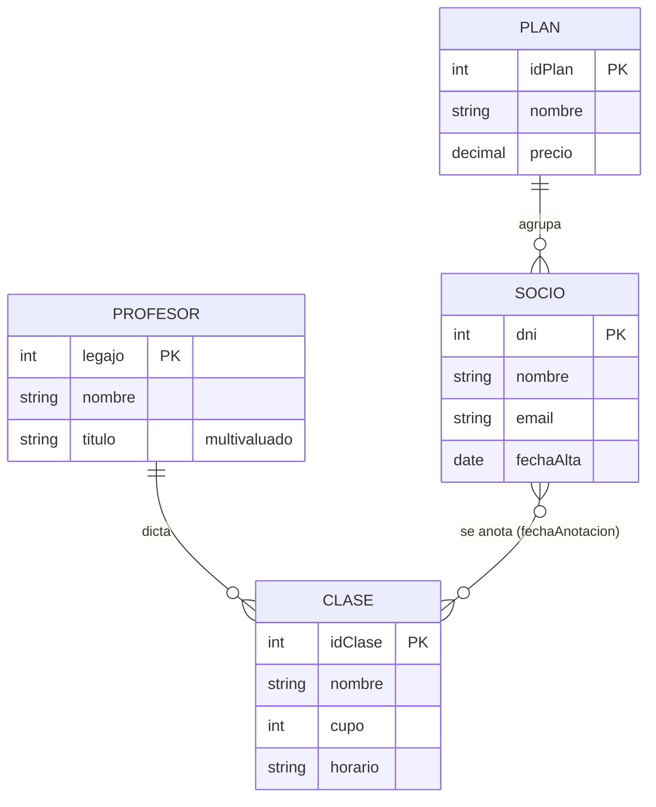
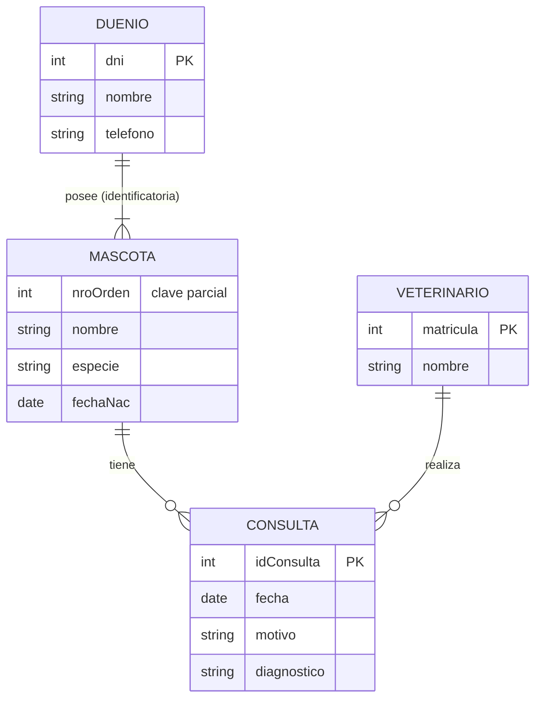
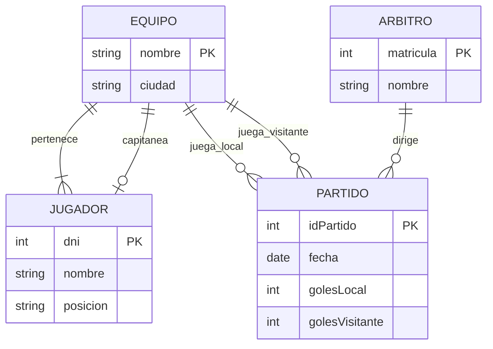
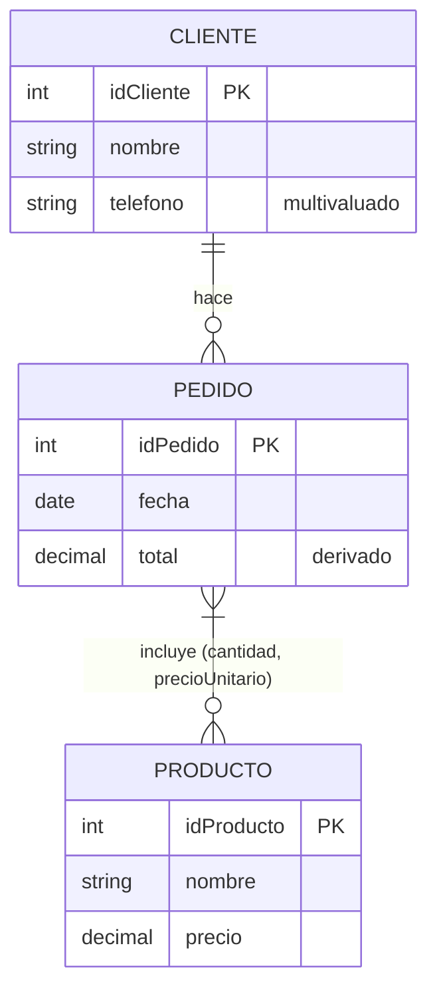

# 02 · Modelado ER — Práctica resuelta

> Ejercicios nuevos, distintos a los TP, de dificultad similar. Cada DER se construye
> paso a paso, explicando cada decisión. Notación ERDPlus / Chen modificada,
> cardinalidad en pares `(mín, máx)`.

---

## Ejercicio 1 — Gimnasio (de coloquial a DER)

**Enunciado.** Un gimnasio quiere gestionar sus clases. De cada **socio** se sabe su DNI,
nombre, email y fecha de alta. El gimnasio ofrece **clases** (spinning, funcional, yoga);
de cada clase interesa un código, el nombre, el cupo máximo y el horario. Cada clase la
**dicta un** profesor; de cada **profesor** se sabe su legajo, nombre y los **títulos**
que posee (puede tener varios). Un socio se **anota** en las clases que quiera y, para
cada anotación, se registra la fecha en que se anotó. Una clase puede no tener a nadie
anotado todavía. Cada socio pertenece a **un plan** (mensual, trimestral, anual) con un
precio; un plan agrupa a muchos socios.

### Paso 1 — Sustantivos → entidades candidatas

`socio`, `clase`, `profesor`, `plan`. Título aparece como "varios títulos" del profesor →
**atributo multivaluado**, no entidad (no se piden datos del título, solo el nombre).

### Paso 2 — Atributos de cada entidad

```
SOCIO(dni PK, nombre, email, fechaAlta)
CLASE(idClase PK, nombre, cupo, horario)
PROFESOR(legajo PK, nombre, titulo {multivaluado})
PLAN(idPlan PK, nombre, precio)
```

### Paso 3 — Verbos → relaciones y cardinalidades

- *"cada clase la dicta un profesor"* → **dicta**
  - `CLASE (1,1) —dicta→ (0,N) PROFESOR`
  - Una clase tiene exactamente un profesor `(1,1)`. Un profesor dicta 0..N clases
    `(0,N)` (puede haber un profe recién contratado sin clases asignadas).
- *"un socio se anota en las clases que quiera"* / *"una clase puede no tener anotados"* →
  **se_anota**
  - `SOCIO (0,N) —se_anota→ (0,N) CLASE`  → **N:M**
  - Atributo de la relación: `fechaAnotacion` (depende del par socio+clase).
- *"cada socio pertenece a un plan"* / *"un plan agrupa muchos socios"* → **pertenece**
  - `SOCIO (1,1) —pertenece→ (0,N) PLAN`  → **1:N**

### Paso 4 — DER en texto y en Mermaid

```
ENTIDADES
  SOCIO(dni PK, nombre, email, fechaAlta)
  CLASE(idClase PK, nombre, cupo, horario)
  PROFESOR(legajo PK, nombre, titulo {multivaluado})
  PLAN(idPlan PK, nombre, precio)

RELACIONES
  pertenece : SOCIO (1,1) ── (0,N) PLAN
  se_anota  : SOCIO (0,N) ── (0,N) CLASE      [atributo: fechaAnotacion]
  dicta     : CLASE (1,1) ── (0,N) PROFESOR
```



### Decisiones explicadas

- **`titulo` multivaluado** y no entidad: el enunciado solo pide "el nombre del título".
  Si pidiera institución y año, sería entidad `TITULO`.
- **`fechaAnotacion` en la relación** `se_anota`: no es del socio (tiene muchas
  anotaciones) ni de la clase (tiene muchos anotados); es del cruce.
- **`pertenece` es `(1,1)` del lado del socio**: "cada socio pertenece a un plan" → no
  puede haber socios sin plan.

---

## Ejercicio 2 — Veterinaria (con entidad débil)

**Enunciado.** Una veterinaria atiende **mascotas**. De cada **dueño** se guarda DNI,
nombre y teléfono. Un dueño puede tener varias mascotas; cada mascota tiene **un solo**
dueño. De cada mascota se sabe un nombre, la especie y la fecha de nacimiento; el nombre
de la mascota **se repite** entre distintos dueños (hay muchos "Firulais"), así que una
mascota se identifica por su dueño más un número de orden dentro de ese dueño. Cada
mascota tiene un historial de **consultas**: fecha, motivo y diagnóstico. Cada consulta la
realiza **un** veterinario (matrícula, nombre).

### Paso 1 — Entidades

`DUEÑO`, `MASCOTA`, `CONSULTA`, `VETERINARIO`.

- **`MASCOTA` es entidad débil:** no tiene clave propia; se identifica por
  `dni_dueño + nro_orden`. Relación identificatoria con `DUEÑO`.
- **`CONSULTA`**: ¿débil o fuerte? Se le puede dar un `idConsulta` autonumérico → fuerte
  con clave sustituta. También podría modelarse como débil de `MASCOTA`
  (`dni + nro_orden + fechaConsulta`). Elegimos **fuerte con `idConsulta`** porque es más
  simple para relacionarla después con `VETERINARIO`. *(Ambas son válidas; se documenta.)*

### Paso 2 — Atributos

```
DUENIO(dni PK, nombre, telefono)
MASCOTA(nroOrden [clave parcial], nombre, especie, fechaNac)      -- débil de DUENIO
CONSULTA(idConsulta PK, fecha, motivo, diagnostico)
VETERINARIO(matricula PK, nombre)
```

### Paso 3 — Relaciones y cardinalidades

- **posee** (identificatoria): `DUENIO (1,N) ══ (1,1) MASCOTA`
  - Un dueño posee 1..N mascotas (para estar en el sistema tiene que tener al menos una);
    cada mascota tiene exactamente un dueño.
- **tiene**: `MASCOTA (1,1) ── (0,N) CONSULTA`
  - Cada consulta es de exactamente una mascota; una mascota tiene 0..N consultas (recién
    ingresada puede no tener ninguna).
- **realiza**: `CONSULTA (1,1) ── (0,N) VETERINARIO`
  - Cada consulta la hace un veterinario; un veterinario hace 0..N consultas.

### DER



### Decisiones explicadas

- **Débil**: el enunciado dice explícitamente que el nombre de la mascota se repite y que
  se identifica "por su dueño más un número de orden". Eso es la definición de entidad
  débil con clave parcial `nroOrden`.
- **`posee` es `(1,N)`** del lado del dueño: un dueño sin ninguna mascota no tendría razón
  de estar cargado.
- Si mañana piden "un mismo tratamiento atendido por varios veterinarios", `realiza`
  pasaría a `(0,N)—(0,N)` y sería N:M.

---

## Ejercicio 3 — Torneo de fútbol (relación unaria + evento como entidad)

**Enunciado.** Se organiza un torneo. De cada **equipo**: nombre (único) y ciudad. De
cada **jugador**: DNI, nombre, posición y el equipo al que pertenece (uno solo). Cada
equipo tiene **un** jugador designado como **capitán** (que es uno de sus jugadores). Se
juegan **partidos**: cada partido enfrenta a dos equipos (local y visitante), tiene fecha,
y un **árbitro** (matrícula, nombre). De cada partido se guarda el resultado (goles local,
goles visitante).

### Análisis

- `EQUIPO`, `JUGADOR`, `ARBITRO` son entidades claras.
- *"cada partido enfrenta a dos equipos"* con datos propios (fecha, resultado) →
  **`PARTIDO` es una entidad** (evento), no una simple relación, porque tiene atributos y
  se vincula además con `ARBITRO`.
- *"un jugador designado como capitán, que es uno de sus jugadores"* → **relación unaria
  no**: es una relación entre `EQUIPO` y `JUGADOR` (1:1), distinta de "pertenece".
- Local y visitante: `PARTIDO` se relaciona **dos veces** con `EQUIPO` (dos roles).

### Atributos

```
EQUIPO(nombre PK, ciudad)
JUGADOR(dni PK, nombre, posicion)
ARBITRO(matricula PK, nombre)
PARTIDO(idPartido PK, fecha, golesLocal, golesVisitante)
```

### Relaciones

- **pertenece**: `JUGADOR (1,1) ── (1,N) EQUIPO`
  (cada jugador en un equipo; un equipo tiene al menos 1 jugador).
- **capitanea**: `EQUIPO (1,1) ── (0,1) JUGADOR`
  (cada equipo tiene exactamente un capitán; un jugador es capitán de 0 o 1 equipo).
- **juega_local**: `PARTIDO (1,1) ── (0,N) EQUIPO`
- **juega_visitante**: `PARTIDO (1,1) ── (0,N) EQUIPO`
- **dirige**: `PARTIDO (1,1) ── (0,N) ARBITRO`

### DER



### Decisiones explicadas

- **`PARTIDO` como entidad** y no como relación ternaria "equipo-equipo-árbitro": tiene
  identidad propia y atributos (fecha, goles). Modelarlo como entidad hace natural
  agregarle después "estadio", "torneo", "fecha del fixture", etc.
- **Dos relaciones separadas** `juega_local` y `juega_visitante`: son dos vínculos con
  distinta semántica; no se pueden fusionar en una sola.
- **`capitanea` `(0,1)` del lado jugador:** la mayoría de los jugadores no son capitanes.

---

## Ejercicio 4 — Corregir un DER con errores

**Enunciado.** Un compañero entregó este DER para una **cafetería**. Detectá y corregí los
errores.

```
CLIENTE(nombre PK, telefono1, telefono2, telefono3)
PEDIDO(fecha, total)
PRODUCTO(nombre, precio)

relaciones:
  hace   : CLIENTE ── PEDIDO           (sin cardinalidades)
  incluye: PEDIDO 1 ── 1 PRODUCTO
```

### Errores detectados

1. **`nombre` como PK de `CLIENTE`:** el nombre se repite y puede cambiar/tipearse mal.
   → usar `dni` o un `idCliente` sustituto; `nombre` queda como atributo común.
2. **`telefono1/2/3`:** atributo multivaluado disfrazado. → atributo **multivaluado**
   `telefono` (o entidad `TELEFONO` si se necesitara tipo/etiqueta).
3. **`PEDIDO` sin clave primaria.** → agregar `idPedido PK`.
4. **`PRODUCTO` sin clave primaria.** → agregar `idProducto PK` (o `codigo`).
5. **Relación `hace` sin cardinalidades.** → `CLIENTE (1,1) —hace→ (0,N) PEDIDO`
   (cada pedido de un cliente; un cliente con 0..N pedidos).
6. **`incluye` como 1:1:** un pedido con un solo producto y un producto en un solo pedido
   es irreal. → **N:M**: `PEDIDO (1,N) —incluye→ (0,N) PRODUCTO`, con atributo `cantidad`
   (y opcionalmente `precioUnitario` al momento de la venta).
7. **`total` de `PEDIDO` es derivado** (suma de `cantidad * precio`). → marcarlo como
   derivado o no guardarlo.

### DER corregido

```
CLIENTE(idCliente PK, nombre, telefono {multivaluado})
PEDIDO(idPedido PK, fecha, total {derivado})
PRODUCTO(idProducto PK, nombre, precio)

RELACIONES
  hace    : CLIENTE (1,1) ── (0,N) PEDIDO
  incluye : PEDIDO (1,N) ── (0,N) PRODUCTO     [atributos: cantidad, precioUnitario]
```



---

## Autoevaluación

1. ¿Cuándo un dato debe ser **entidad** en vez de **atributo**?
2. ¿Qué diferencia hay entre `(0,N)` y `(1,N)` en un extremo de la relación?
3. ¿Dónde van los atributos que dependen de la **combinación** de dos entidades?
4. ¿Qué caracteriza a una **entidad débil**?
5. En "un empleado puede tener un supervisor que es otro empleado", ¿qué grado tiene la
   relación?

<details>
<summary>Respuestas</summary>

1. Cuando tiene datos propios además del nombre, o cuando puede tener varios valores.
2. `(0,N)`: la participación es opcional (puede haber instancias sin relacionar). `(1,N)`:
   participación obligatoria (toda instancia debe relacionarse con al menos una).
3. En la **relación** (que en el modelo relacional se convertirá en tabla puente).
4. No tiene clave propia; se identifica con la clave de la entidad fuerte más una clave
   parcial, a través de una relación identificatoria.
5. **Unaria (recursiva)**: `EMPLEADO` se relaciona consigo misma.

</details>
