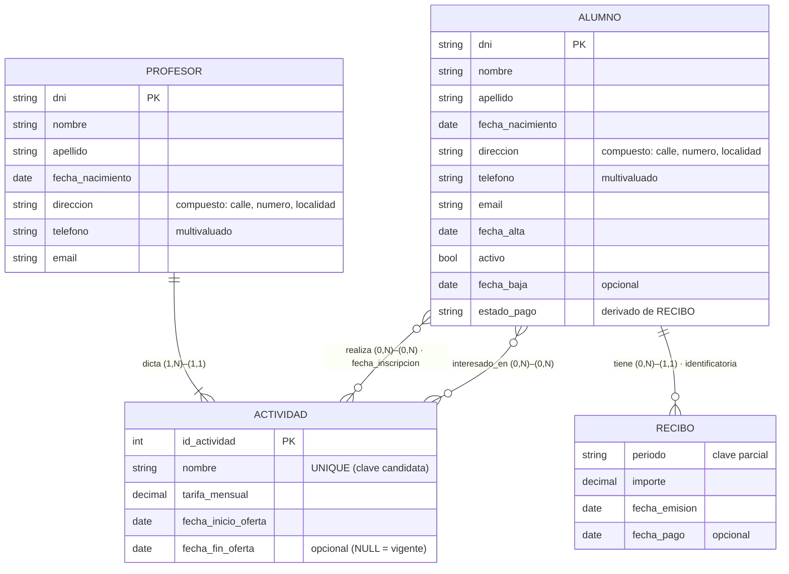

# Hito Evaluable 2 – Resolución

**Materia:** Bases de Datos · TUCD (UGR) · 2026
**Estudio de caso:** Sistema de gestión de un gimnasio
**Entregable:** Diagrama Entidad‑Relación (DER)
**Herramienta de modelado:** ERDPlus (notación Chen modificada de la cátedra) · archivo [`HE2_gimnasio.erdplus`](HE2_gimnasio.erdplus)

> **Notación usada**
> - Entidad = rectángulo · Entidad débil = rectángulo doble.
> - Atributo = elipse · **PK** = subrayado (`Unique`) · **clave parcial** = subrayado punteado (`Partially Unique`).
> - Atributo **multivaluado** = doble elipse · **derivado** = elipse punteada · **compuesto** = elipse con sub‑elipses · **opcional** = admite `NULL`.
> - Relación = rombo · Relación identificatoria (de entidad débil) = rombo doble.
> - Cardinalidad en pares **(mín, máx)** sobre cada extremo, tal como los usa la cátedra: `(0,1)`, `(1,1)`, `(0,N)`, `(1,N)`.
>   Se lee como la **participación de esa entidad** en la relación.

---

## 1. Identificación de entidades

| Entidad | Tipo | Justificación (del enunciado) |
|---|---|---|
| **ACTIVIDAD** | Fuerte | *"El gimnasio ofrece diferentes actividades…"*. Tiene existencia propia, datos propios (tarifa, fechas de oferta) y se relaciona con profesores y alumnos. |
| **PROFESOR** | Fuerte | *"Cada actividad es impartida por un profesor… De cada profesor deberá almacenarse información personal y de contacto"*. Entidad con identidad propia (DNI). |
| **ALUMNO** | Fuerte | *"De cada alumno se desea registrar información personal y de contacto…"*. Además *"sus datos deberán conservarse"* aunque deje de asistir → nunca se borra, es una entidad persistente. |
| **RECIBO** | **Débil** (de ALUMNO) | *"Se deberá mantener un registro de los recibos o cuotas mensuales correspondientes a cada alumno"*. Un recibo **no se identifica por sí solo**: "el recibo del período 2026‑03" no señala nada; "el recibo del período 2026‑03 **del alumno X**" sí. Su identificación depende de ALUMNO → entidad débil con clave parcial `periodo`. |

**Elementos del enunciado que NO son entidades:**

- *"actividades que tiene a su cargo"* (profesor), *"actividades que realiza"* / *"actividades de interés"* (alumno): **no son atributos** de PROFESOR ni de ALUMNO, sino **relaciones** con ACTIVIDAD (ver §3). Modelarlas como atributos multivaluados haría imposible guardar la tarifa, el profesor o las fechas de cada actividad.
- *"situación respecto del pago"* / *"estado de pago"*: es un **atributo derivado** de ALUMNO, calculado a partir de RECIBO (ver §2).
- *"tarifa mensual"*: atributo de ACTIVIDAD (es *"fija"* por actividad), no una entidad ni un atributo del alumno.

---

## 2. Atributos por entidad

### ACTIVIDAD
| Atributo | Tipo | Observación |
|---|---|---|
| `id_actividad` | **PK** (clave sustituta) | Se agrega un identificador propio: protege ante cambios de nombre y simplifica las FK de las relaciones N:M. |
| `nombre` | Clave candidata (`Unique`) | *"Culturismo, Pilates, Ritmo, CrossFit…"*. No se repite; es la clave natural, se mantiene como `UNIQUE`. |
| `tarifa_mensual` | Simple | *"Cada actividad posee una tarifa mensual fija"*. |
| `fecha_inicio_oferta` | Simple | *"guardando las fechas de inicio… de la oferta"*. |
| `fecha_fin_oferta` | **Opcional** (`NULL`) | *"…y fin de la oferta"*. Está vacía mientras la actividad **sigue ofreciéndose**; se completa cuando deja de ofrecerse. Permite la consulta *"actividades que se ofrecen actualmente"* = `fecha_fin_oferta IS NULL` (o futura). |

### PROFESOR
| Atributo | Tipo | Observación |
|---|---|---|
| `dni` | **PK** | Clave natural estable y única de una persona. |
| `nombre` | Simple | Información personal. |
| `apellido` | Simple | Información personal. |
| `fecha_nacimiento` | Simple | Información personal. |
| `direccion` | **Compuesto** → `calle`, `numero`, `localidad` | Información de contacto; se descompone para poder consultar por localidad. |
| `telefono` | **Multivaluado** | *"información… de contacto"*: una persona puede tener varios teléfonos (celular, fijo, alternativo). |
| `email` | Simple | Información de contacto. |

### ALUMNO
| Atributo | Tipo | Observación |
|---|---|---|
| `dni` | **PK** | Clave natural estable y única. |
| `nombre` | Simple | Información personal. |
| `apellido` | Simple | Información personal. |
| `fecha_nacimiento` | Simple | Información personal. |
| `direccion` | **Compuesto** → `calle`, `numero`, `localidad` | Contacto; se descompone. |
| `telefono` | **Multivaluado** | Igual criterio que en PROFESOR. |
| `email` | Simple | Necesario para *"el envío de información sobre promociones, ofertas o nuevas actividades"*. |
| `fecha_alta` | Simple | Fecha en que se incorporó al gimnasio. |
| `activo` | Simple (booleano) | *"Un alumno puede dejar de asistir… sus datos deberán conservarse"*. **No se borra el registro**: se marca `activo = falso`. Así se mantiene el historial y se lo puede seguir contactando. |
| `fecha_baja` | **Opcional** (`NULL`) | Se completa sólo cuando el alumno deja de asistir. |
| `estado_pago` | **Derivado** | *"cuál es su situación respecto del pago de las cuotas"*. Se calcula a partir de RECIBO: **"con deuda"** si existe algún recibo con `fecha_emision` y sin `fecha_pago`; **"al día"** en caso contrario. No se almacena para evitar inconsistencias. |

### RECIBO  *(entidad débil de ALUMNO)*
| Atributo | Tipo | Observación |
|---|---|---|
| `periodo` | **Clave parcial** (`Partially Unique`) | *"el período al que corresponde"* (mes/año, p. ej. `2026-03`). Único **dentro de cada alumno**. La PK completa del recibo es `dni_alumno + periodo`. |
| `importe` | Simple | *"el importe"*. Total del período (la aplicación lo obtiene sumando las tarifas de las actividades que el alumno realiza; el recibo no se desglosa por actividad, el enunciado no lo pide). |
| `fecha_emision` | Simple | *"la fecha de emisión"*. |
| `fecha_pago` | **Opcional** (`NULL`) | *"cuando corresponda, la fecha de pago"*. Como *"los pagos deben ser totales, no se admiten pagos parciales"*, **su sola presencia indica que el recibo fue pagado íntegramente**; por eso no hace falta un atributo "monto pagado". |

---

## 3. Relaciones y cardinalidades

| Relación | Extremos y cardinalidad **(mín, máx)** | Tipo | Atributos | Justificación |
|---|---|---|---|---|
| **dicta** | `PROFESOR` **(1,N)** — `ACTIVIDAD` **(1,1)** | 1:N | — | *"Cada actividad es impartida por **un** profesor"* → la actividad participa exactamente una vez `(1,1)`. *"Un mismo profesor puede estar a cargo de **una o más** actividades"* → `(1,N)`. La PK de PROFESOR baja como FK **obligatoria** a ACTIVIDAD. |
| **realiza** | `ALUMNO` **(0,N)** — `ACTIVIDAD` **(0,N)** | N:M | `fecha_inscripcion` | *"qué actividad **o actividades** realiza actualmente"* → un alumno realiza 0..N actividades (0: alumno dado de baja cuyos datos se conservan, o sólo interesado). Una actividad la realizan 0..N alumnos (0: actividad nueva sin inscriptos). N:M → tabla intermedia; `fecha_inscripcion` es dato del **vínculo** (desde cuándo hace esa actividad). |
| **interesado_en** | `ALUMNO` **(0,N)** — `ACTIVIDAD` **(0,N)** | N:M | — | *"qué otras actividades estaría interesado en realizar"*. Es una relación **distinta** de `realiza` aunque una los mismos dos tipos de entidad: expresa una intención futura, no una inscripción. Ambos extremos `(0,N)`: un alumno puede no tener ningún interés registrado y una actividad puede no interesarle a nadie. Sirve para *"el envío de información sobre… nuevas actividades"*. |
| **tiene** *(identificatoria)* | `ALUMNO` **(0,N)** — `RECIBO` **(1,1)** | 1:N | — | *"los recibos… correspondientes a **cada alumno**"* → cada recibo pertenece a **exactamente un** alumno `(1,1)` (participación total: no existe un recibo sin alumno). Un alumno acumula 0..N recibos (uno por período; 0 si recién se inscribe). Relación **identificatoria**: la PK de RECIBO es `dni_alumno + periodo`. |

**Lectura de cada relación en ambos sentidos**

- `dicta`: *"un profesor dicta una o muchas actividades"* / *"una actividad es dictada por un único profesor"*.
- `realiza`: *"un alumno realiza cero o muchas actividades"* / *"una actividad es realizada por cero o muchos alumnos"*.
- `interesado_en`: *"un alumno está interesado en cero o muchas actividades"* / *"una actividad interesa a cero o muchos alumnos"*.
- `tiene`: *"un alumno tiene cero o muchos recibos"* / *"un recibo pertenece a exactamente un alumno"*.

---

## 4. Diagrama Entidad‑Relación



> El diagrama para importar y presentar está en **`HE2_gimnasio.erdplus`** (formato nativo de erdplus.com):
> RECIBO aparece como entidad **débil** (rectángulo doble), `direccion` como atributo **compuesto**,
> `telefono` como **multivaluado**, `estado_pago` como **derivado**, y `realiza` / `interesado_en`
> como dos rombos separados entre ALUMNO y ACTIVIDAD.

### Descripción textual del DER

```
ENTIDADES
  ACTIVIDAD(id_actividad PK, nombre UNIQUE, tarifa_mensual,
            fecha_inicio_oferta, fecha_fin_oferta [opcional])
  PROFESOR (dni PK, nombre, apellido, fecha_nacimiento,
            direccion{calle, numero, localidad}, telefono {multivaluado}, email)
  ALUMNO   (dni PK, nombre, apellido, fecha_nacimiento,
            direccion{calle, numero, localidad}, telefono {multivaluado}, email,
            fecha_alta, activo, fecha_baja [opcional], estado_pago [derivado])
  RECIBO   (periodo [clave parcial], importe, fecha_emision, fecha_pago [opcional])   -- débil de ALUMNO

RELACIONES
  dicta         : PROFESOR (1,N) ── (1,1) ACTIVIDAD
  realiza       : ALUMNO (0,N) ── (0,N) ACTIVIDAD        [atributo: fecha_inscripcion]
  interesado_en : ALUMNO (0,N) ── (0,N) ACTIVIDAD
  tiene         : ALUMNO (0,N) ═══ (1,1) RECIBO          (identificatoria)
```

---

## 5. Decisiones de diseño y supuestos

1. **RECIBO como entidad débil.** El enunciado ata los recibos a *"cada alumno"* y pide como mínimo `periodo`, `importe`, `fecha_emision` y `fecha_pago`. `periodo` sólo es único **por alumno**, así que la identificación de RECIBO es `dni_alumno + periodo` a través de la relación identificatoria `tiene`.
   *Alternativa válida:* RECIBO fuerte con `nro_recibo` sustituto y `UNIQUE(dni_alumno, periodo)`; se optó por la débil por ser más fiel a la semántica.
2. **`estado_pago` derivado, no almacenado.** Guardarlo como dato fijo generaría inconsistencias (habría que actualizarlo con cada pago). Se deriva de los recibos impagos.
3. **`fecha_fin_oferta` opcional = actividad vigente.** Es lo que habilita la consulta pedida: *"consultar las actividades que se ofrecen actualmente junto con sus respectivas tarifas"* → `SELECT nombre, tarifa_mensual FROM actividad WHERE fecha_fin_oferta IS NULL OR fecha_fin_oferta >= CURRENT_DATE`.
4. **Baja lógica del alumno (`activo` + `fecha_baja`).** *"sus datos deberán conservarse"* ⇒ no hay borrado físico; el alumno inactivo sigue en la base para historial y para *"el envío de información sobre promociones"*.
5. **Dos relaciones N:M entre ALUMNO y ACTIVIDAD.** `realiza` (inscripción vigente, con `fecha_inscripcion`) e `interesado_en` (intención) son hechos distintos y deben poder coexistir para el mismo par (un alumno puede hacer Pilates y además estar interesado en CrossFit).
6. **`importe` del recibo sin desglose por actividad.** El enunciado sólo pide `período/importe/fecha_emisión/fecha_pago`. El importe es el total del período; la relación con las actividades que lo componen se resuelve por aplicación a partir de `realiza` + `tarifa_mensual`. No se agregan entidades que el enunciado no menciona.
7. **`pagos totales` ⇒ sin atributo "monto pagado".** La presencia de `fecha_pago` indica pago íntegro del `importe`.
8. **`dicta` con profesor obligatorio `(1,N)`.** El enunciado dice *"una o más"* actividades por profesor. Si el gimnasio quisiera precargar profesores sin actividad asignada, el mínimo pasaría a `(0,N)` sin otro cambio estructural.
9. **Claves.** `dni` como PK natural de personas (estable y único); `id_actividad` sustituto en ACTIVIDAD con `nombre` como candidata `UNIQUE` (evita duplicados por error de tipeo, tal como advierte la cátedra).

---

## 6. Consulta que el modelo habilita (requerida por el enunciado)

*"Actividades que se ofrecen actualmente junto con sus tarifas"* (para folletos):

```sql
SELECT nombre, tarifa_mensual
FROM   actividad
WHERE  fecha_fin_oferta IS NULL
   OR  fecha_fin_oferta >= CURRENT_DATE;
```

Otras consultas soportadas: recibos impagos por alumno (`estado_pago`), alumnos interesados en una actividad nueva (para promociones), actividades a cargo de cada profesor.

---

## 7. Cobertura de la rúbrica

| Criterio | Dónde se cumple |
|---|---|
| **Entidades correctamente identificadas** (1 pt) | §1: ACTIVIDAD, PROFESOR, ALUMNO (fuertes) y RECIBO (débil). Se explicita qué elementos del enunciado **no** son entidades. |
| **Relaciones establecidas y justificadas** (2 pts) | §3: `dicta`, `realiza`, `interesado_en`, `tiene`, cada una con lectura en ambos sentidos y cita del enunciado. Se justifica por qué `realiza` e `interesado_en` son dos relaciones distintas. |
| **Cardinalidades precisas (Chen modificada)** (2 pts) | §3 y §4: todos los extremos con par `(mín, máx)` — `(1,1)`, `(1,N)`, `(0,N)` — y su interpretación como participación. |
| **Atributos bien definidos y asignados** (2 pts) | §2: cada atributo con su entidad y su tipo (PK, clave candidata, clave parcial, simple, compuesto, multivaluado, derivado, opcional). Se aclara que "actividades a cargo/realiza/interés" son relaciones, no atributos. |
| **Diagrama claro y bien estructurado** (1 pt) | §4 (Mermaid + descripción textual) y `HE2_gimnasio.erdplus` con el enunciado incluido como nota, entidades separadas por rol y notación completa. |
| **Consistencia total con el enunciado** (2 pts) | §5: cada decisión se ancla en una frase del enunciado; no se agregan entidades ni atributos que el enunciado no pida (recibo sin desglose, sin pagos parciales, baja lógica, oferta vigente por `fecha_fin_oferta`). |
