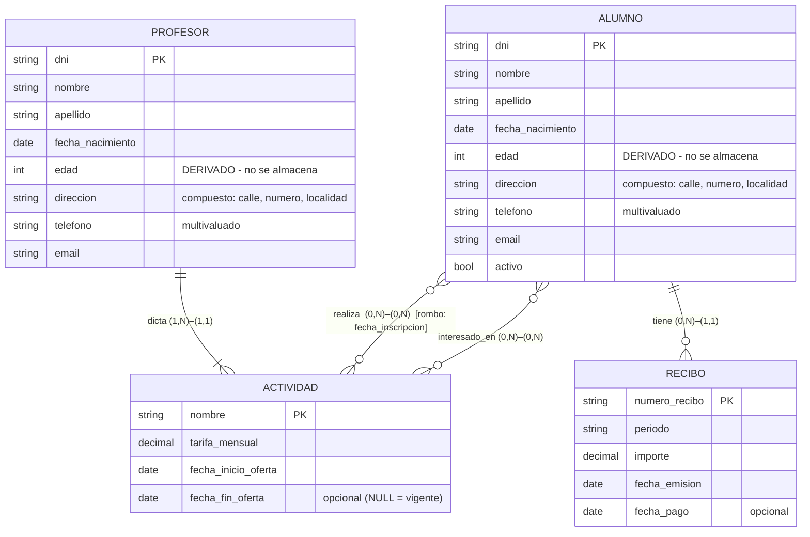

# Hito Evaluable 2 – Resolución

**Materia:** Bases de Datos · TUCD (UGR) · 2026
**Estudio de caso:** Sistema de gestión de un gimnasio
**Entregable:** Diagrama Entidad‑Relación (DER)
**Herramienta:** ERDPlus (notación Chen modificada de la cátedra) · archivo [`HE2_gimnasio.erdplus`](HE2_gimnasio.erdplus)

> **Metodología aplicada (pautas del profesor)**
> 1. **No se rompen las relaciones N:M**: quedan como rombos, con sus atributos **dentro del rombo**.
> 2. **Una sola clave por entidad, natural**: se usa el identificador del dominio (DNI, nombre de la
>    actividad, número del recibo), **no** un `id_` sintético.
> 3. **Los atributos calculados / derivados no se almacenan**: se marcan como derivados.
> 4. **Los atributos de una relación N:M van en el rombo**, nunca en las entidades.
> 5. **Cardinalidades en pares (mín, máx)**: `(0,1)`, `(1,1)`, `(0,N)`, `(1,N)`, leídas como la
>    participación de cada entidad en la relación.

---

## 1. Entidades

| Entidad | Clave primaria (natural) | Justificación de la PK |
|---|---|---|
| **ACTIVIDAD** | `nombre` | *"Culturismo, Pilates, Ritmo, CrossFit…"*. Los nombres de las actividades **no se repiten** y no cambian; es el identificador natural con el que se las nombra en los folletos. No hace falta un `id_actividad`. |
| **PROFESOR** | `dni` | Identificador natural, único y estable de una persona; existe fuera del sistema. |
| **ALUMNO** | `dni` | Ídem. *(El `numero_socio` sería una clave candidata alternativa, pero el DNI ya identifica de forma natural y no se reasigna.)* |
| **RECIBO** | `numero_recibo` | Un recibo / comprobante lleva un **número correlativo propio** asignado al emitirlo (como el número de una factura). Es un identificador **natural del documento**, no un `id_` sintético. |

Las cuatro son **entidades fuertes**: cada una tiene su propia clave natural y existencia independiente.

> **Sobre RECIBO:** también sería válido modelarlo como **entidad débil** de ALUMNO, identificada por
> `dni_alumno + periodo`. Se optó por la entidad fuerte con `numero_recibo` porque el enunciado y la
> pauta piden **una única clave natural por entidad**, y un comprobante ya tiene su número propio.

**Elementos del enunciado que NO son entidades ni atributos de entidad:**

- *"qué actividades realiza"* / *"en cuáles está interesado"* (alumno) y *"actividades a cargo"*
  (profesor) → son **relaciones** con ACTIVIDAD (§3), no atributos multivaluados. Si fueran atributos
  no podríamos guardar la tarifa ni el profesor de cada actividad.
- *"situación respecto del pago"* → **no es un atributo** de ALUMNO: se **deriva** de RECIBO (existe
  algún recibo con `fecha_emision` y sin `fecha_pago` ⇒ el alumno debe). Como es un dato calculado,
  **no se almacena**.

---

## 2. Atributos por entidad

### ACTIVIDAD
| Atributo | Tipo | Justificación |
|---|---|---|
| `nombre` | **PK** (natural) | Identifica la actividad; no se repite. |
| `tarifa_mensual` | Simple | *"Cada actividad posee una tarifa mensual fija"*. |
| `fecha_inicio_oferta` | Simple | *"guardando las fechas de inicio… de la oferta"*. |
| `fecha_fin_oferta` | **Opcional** (`NULL`) | *"…y fin de la oferta"*. Vacía mientras la actividad **sigue ofreciéndose**; se completa al darla de baja. Habilita la consulta *"actividades ofrecidas actualmente"*. |
| *(vigente)* | **Derivado – NO se almacena** | Se calcula: `fecha_fin_oferta IS NULL OR fecha_fin_oferta >= CURRENT_DATE`. No es una columna. |

### PROFESOR
| Atributo | Tipo | Justificación |
|---|---|---|
| `dni` | **PK** (natural) | Identificador de la persona. |
| `nombre`, `apellido`, `fecha_nacimiento` | Simple | Datos personales. |
| `edad` | **Derivado – NO se almacena** | Se calcula a partir de `fecha_nacimiento`. No es una columna. |
| `direccion` | **Compuesto** → `calle`, `numero`, `localidad` | Dato de contacto; se descompone para poder consultar por localidad. |
| `telefono` | **Multivaluado** | Un profesor puede tener varios teléfonos (celular, fijo). |
| `email` | Simple | Dato de contacto. |

### ALUMNO
| Atributo | Tipo | Justificación |
|---|---|---|
| `dni` | **PK** (natural) | Identificador de la persona. |
| `nombre`, `apellido`, `fecha_nacimiento` | Simple | Datos personales. |
| `edad` | **Derivado – NO se almacena** | Calculada desde `fecha_nacimiento`. |
| `direccion` | **Compuesto** → `calle`, `numero`, `localidad` | Contacto. Necesario para *"el envío de información sobre promociones"*. |
| `telefono` | **Multivaluado** | Igual criterio que en PROFESOR. |
| `email` | Simple | Contacto / envío de promociones. |
| `activo` | Simple (booleano) | *"si asiste o no"*. Si el alumno deja de asistir se pone `activo = falso`; **el registro no se borra** para conservar el historial y poder seguir contactándolo. |

### RECIBO
| Atributo | Tipo | Justificación |
|---|---|---|
| `numero_recibo` | **PK** (natural) | Número correlativo del comprobante. |
| `periodo` | Simple | *"el período al que corresponde"* (mes/año, p. ej. `2026-03`). |
| `importe` | Simple – **se almacena** | *"el importe"*. Aunque se calcula al emitir (suma de `tarifa_mensual` de las actividades que el alumno realiza en ese período), es un **dato histórico del documento**: queda congelado y no debe cambiar si luego cambian las tarifas. Por eso **sí se guarda** (a diferencia de `edad` o *vigente*). |
| `fecha_emision` | Simple | *"la fecha de emisión"*. |
| `fecha_pago` | **Opcional** (`NULL`) | *"cuando corresponda, la fecha de pago"*. Como *"los pagos deben ser totales"*, **su sola presencia indica recibo saldado íntegramente**; no hace falta un atributo "monto pagado". |

---

## 3. Relaciones y cardinalidades

| Relación | Extremos y cardinalidad **(mín, máx)** | Tipo | Atributos (en el rombo) | Justificación |
|---|---|---|---|---|
| **dicta** | `PROFESOR` **(1,N)** — `ACTIVIDAD` **(1,1)** | **1:N** | — | *"Cada actividad es impartida por **un** profesor"* → la actividad participa exactamente una vez `(1,1)`. *"Un profesor puede estar a cargo de **una o más** actividades"* → `(1,N)`. |
| **realiza** | `ALUMNO` **(0,N)** — `ACTIVIDAD` **(0,N)** | **N:M** *(se deja como rombo, no se rompe)* | **`fecha_inscripcion`** | *"qué actividad **o actividades** realiza"* → N:M. `(0,N)` de ambos lados: un alumno inactivo puede no realizar ninguna; una actividad nueva puede no tener inscriptos. **`fecha_inscripcion` depende del par (alumno, actividad)** ⇒ va **en el rombo**, no en ALUMNO ni en ACTIVIDAD. |
| **interesado_en** | `ALUMNO` **(0,N)** — `ACTIVIDAD` **(0,N)** | **N:M** *(rombo, sin atributos)* | — | *"en cuáles está interesado"*. Relación **distinta** de `realiza` aunque una a las mismas entidades: expresa una intención, no una inscripción. `(0,N)`–`(0,N)`: puede no haber ningún interés registrado y una actividad puede no interesarle a nadie. Sirve para *"el envío de información sobre nuevas actividades"*. |
| **tiene** | `ALUMNO` **(0,N)** — `RECIBO` **(1,1)** | **1:N** | — | *"los recibos correspondientes a **cada alumno**"* → cada recibo pertenece a **exactamente un** alumno `(1,1)`; participación total (no hay recibo sin alumno). Un alumno acumula 0..N recibos (0 si recién se inscribe). Es una relación normal: RECIBO tiene su propia PK. |

**Lectura de cada relación en ambos sentidos**

- `dicta`: *"un profesor dicta una o muchas actividades"* / *"una actividad la dicta exactamente un profesor"*.
- `realiza`: *"un alumno realiza cero o muchas actividades"* / *"una actividad la realizan cero o muchos alumnos"*.
- `interesado_en`: *"un alumno está interesado en cero o muchas actividades"* / *"una actividad interesa a cero o muchos alumnos"*.
- `tiene`: *"un alumno tiene cero o muchos recibos"* / *"un recibo pertenece a exactamente un alumno"*.

---

## 4. Diagrama Entidad‑Relación



> **En `HE2_gimnasio.erdplus`:** `realiza` e `interesado_en` son **rombos** (N:M sin romper);
> `fecha_inscripcion` cuelga del rombo `realiza`; `edad` aparece como atributo **derivado** (elipse
> punteada) en ALUMNO y PROFESOR; `direccion` como **compuesto**, `telefono` como **multivaluado**;
> cada entidad tiene **un único atributo subrayado** (PK natural). El enunciado va como nota de texto.

### Descripción textual

```
ENTIDADES  (PK natural única, subrayada)
  ACTIVIDAD(nombre, tarifa_mensual, fecha_inicio_oferta, fecha_fin_oferta [opcional])
  PROFESOR (dni, nombre, apellido, fecha_nacimiento, edad [derivado],
            direccion{calle, numero, localidad}, telefono {multivaluado}, email)
  ALUMNO   (dni, nombre, apellido, fecha_nacimiento, edad [derivado],
            direccion{calle, numero, localidad}, telefono {multivaluado}, email, activo)
  RECIBO   (numero_recibo, periodo, importe, fecha_emision, fecha_pago [opcional])

RELACIONES
  dicta         : PROFESOR (1,N) ── (1,1) ACTIVIDAD
  realiza       : ALUMNO (0,N) ──◇── (0,N) ACTIVIDAD        ◇ atributo: fecha_inscripcion
  interesado_en : ALUMNO (0,N) ──◇── (0,N) ACTIVIDAD        (sin atributos)
  tiene         : ALUMNO (0,N) ── (1,1) RECIBO
```

---

## 5. Decisiones de diseño (cada una anclada al enunciado y a la metodología)

1. **PKs naturales, una por entidad.** `nombre` (ACTIVIDAD), `dni` (PROFESOR, ALUMNO),
   `numero_recibo` (RECIBO). No se introduce ningún `id_` sintético: en todos los casos existe un
   identificador propio del dominio.
2. **`realiza` e `interesado_en` quedan como N:M (rombos).** No se sustituyen por entidades
   asociativas. `fecha_inscripcion` —único dato que **no pertenece** ni al alumno ni a la actividad
   por separado— va **dentro del rombo `realiza`**.
3. **`edad` es derivado y no se guarda.** Se calcula desde `fecha_nacimiento`. Se marca como
   atributo derivado para dejar explícito que **no es una columna**.
4. **La "vigencia" de una actividad es derivada.** No hay un booleano `vigente`; se obtiene de
   `fecha_fin_oferta`. Esto habilita, sin datos redundantes, la consulta pedida:
   ```sql
   SELECT nombre, tarifa_mensual
   FROM   actividad
   WHERE  fecha_fin_oferta IS NULL OR fecha_fin_oferta >= CURRENT_DATE;
   ```
5. **`importe` del recibo SÍ se almacena.** Aunque surge de una suma, es un **valor histórico
   congelado** al emitir el comprobante (igual que el precio de una línea de factura): si mañana
   cambia una tarifa, los recibos ya emitidos no deben alterarse. Por eso **no** se modela como
   derivado.
6. **Baja lógica del alumno (`activo`).** *"sus datos deberán conservarse"* ⇒ no hay borrado
   físico; `activo = falso` marca al que dejó de asistir, que sigue en la base para historial y
   promociones.
7. **`estado_pago` no es atributo.** Se deriva de RECIBO (recibos sin `fecha_pago`).
8. **Pagos totales ⇒ sin "monto pagado".** La presencia de `fecha_pago` indica pago íntegro del
   `importe`.
9. **Dos relaciones N:M entre ALUMNO y ACTIVIDAD.** `realiza` (inscripción, con
   `fecha_inscripcion`) e `interesado_en` (intención) son hechos distintos que pueden coexistir para
   el mismo par (un alumno hace Pilates y además le interesa CrossFit).
10. **RECIBO sin desglose por actividad.** El enunciado sólo pide `periodo`, `importe`,
    `fecha_emision`, `fecha_pago`. No se agregan entidades que el enunciado no menciona; la relación
    con las actividades que componen el importe se resuelve por aplicación (`realiza` + `tarifa_mensual`).
11. **`dicta` con profesor obligatorio `(1,N)`.** El enunciado dice *"una o más"* actividades por
    profesor. Si el gimnasio quisiera precargar profesores sin actividad, el mínimo pasaría a
    `(0,N)` sin otro cambio.

---

## 6. Consulta requerida por el enunciado

*"Actividades ofrecidas actualmente con sus tarifas"* (para folletos): ver §5.4.
Otras consultas que habilita el modelo: recibos impagos por alumno, alumnos interesados en una
actividad nueva (promociones), actividades a cargo de cada profesor.

---

## 7. Cobertura de la rúbrica

| Criterio | Dónde se cumple |
|---|---|
| **Entidades correctamente identificadas** (1 pt) | §1: ACTIVIDAD, PROFESOR, ALUMNO, RECIBO (todas fuertes, cada una con su **PK natural única**). Se explicita qué elementos del enunciado **no** son entidades ni atributos. |
| **Relaciones establecidas y justificadas** (2 pts) | §3: `dicta` (1:N), `realiza` (N:M), `interesado_en` (N:M), `tiene` (1:N), con lectura en ambos sentidos y cita del enunciado; se justifica por qué `realiza` e `interesado_en` son dos relaciones distintas y por qué **no se rompen**. |
| **Cardinalidades precisas (Chen modificada)** (2 pts) | §3 y §4: todos los extremos con par `(mín, máx)` — `(1,1)`, `(1,N)`, `(0,N)` — e interpretación como participación. |
| **Atributos bien definidos y asignados** (2 pts) | §2: cada atributo con su entidad y su tipo (PK natural, simple, compuesto, multivaluado, **derivado – no almacenado**, opcional). `fecha_inscripcion` asignado **al rombo** `realiza`, no a las entidades. |
| **Diagrama claro y bien estructurado** (1 pt) | §4 (Mermaid + descripción) y `HE2_gimnasio.erdplus` (importable, sin solapamientos, con el enunciado como nota y notación completa). |
| **Consistencia total con el enunciado** (2 pts) | §5: cada decisión anclada a una frase del enunciado; no se agregan entidades ni atributos no pedidos; se respeta la metodología (N:M sin romper, PK natural única, derivados no almacenados, atributos de la N:M en el rombo). |
