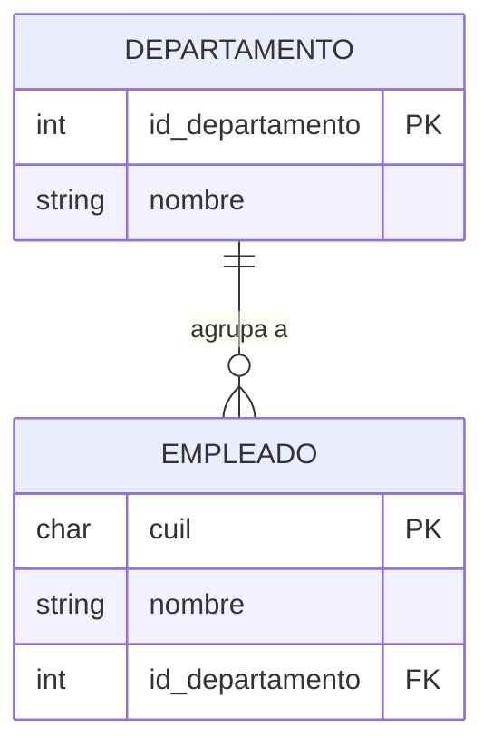
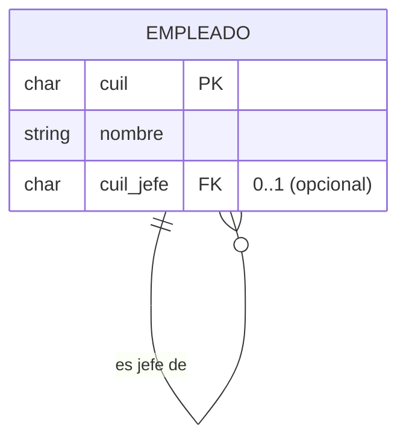
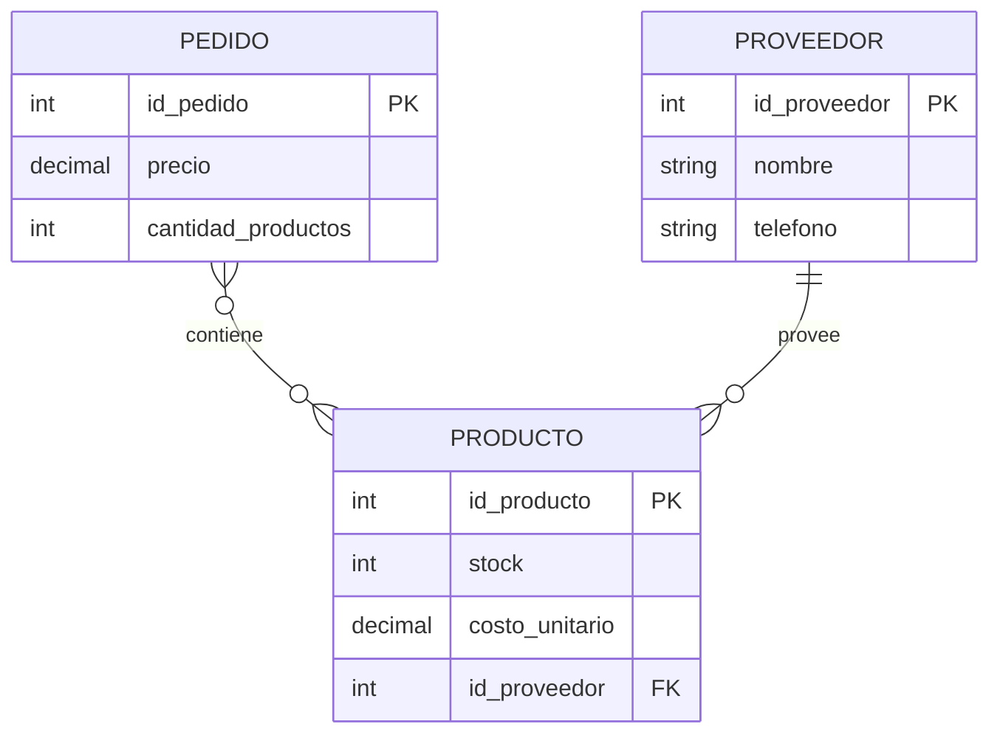
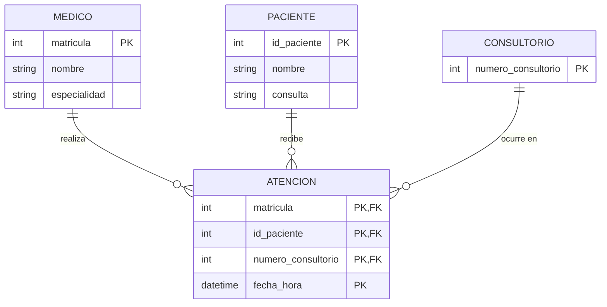

# Unidad I – Trabajo Práctico 1 – Resolución

**Materia:** Bases de Datos · TUCD (UGR) · 2026
**Herramienta de modelado:** ERDPlus (notación Chen modificada de la cátedra)
**SGBD:** MariaDB 11.8.6 · **Script:** [`TP1_esquema.sql`](TP1_esquema.sql)

> **Notación usada en este documento**
> - Entidades = rectángulos (en los diagramas Mermaid, bloques con sus atributos).
> - Atributos: `PK` = clave primaria (subrayada en ERDPlus), `FK` = clave foránea.
> - Cardinalidad en pares **(mín, máx)** sobre cada extremo de la relación, tal como
>   los usa la cátedra: `(0,1)`, `(1,1)`, `(0,N)`, `(1,N)`.
> - Relaciones N:M → se resuelven con una tabla intermedia en el Modelo Relacional.
> - En el Modelo Relacional: `<u>atributo</u>` = PK, `*atributo*` = FK.

---

## Ejercicio 1 – De explicación coloquial a Diagrama de Entidad-Relación

### a) Departamento – Empleado

> Un departamento posee ID y Nombre. Un empleado tiene CUIL y Nombre. Cada empleado
> forma parte de **un** departamento; un departamento puede tener **múltiples** empleados.

**DER**



**Entidades, atributos y relación**

| Elemento | Detalle |
|---|---|
| Entidad `DEPARTAMENTO` | `id_departamento` (PK), `nombre` |
| Entidad `EMPLEADO` | `cuil` (PK), `nombre` |
| Relación `pertenece` | `EMPLEADO` **(1,1)** — `DEPARTAMENTO` **(0,N)** |

Un empleado pertenece siempre a exactamente un departamento (participación total, `(1,1)`).
Un departamento puede existir sin empleados y, como máximo, tener muchos (`(0,N)`).
Es una relación **1:N**; la PK del lado "1" (`DEPARTAMENTO`) baja como FK **obligatoria** al lado "N" (`EMPLEADO`).

**Modelo Relacional**

```
DEPARTAMENTO(<u>id_departamento</u>, nombre)
EMPLEADO(<u>cuil</u>, nombre, *id_departamento*)
        *id_departamento* → DEPARTAMENTO.id_departamento   [NOT NULL]
```

---

### b) Jerarquía de jefes (relación unaria)

> Un empleado puede tener **hasta un** jefe, que es otro empleado de la planta.
> Un empleado jefe puede tener **varios** empleados a su cargo.

**DER**



**Entidades, atributos y relación**

| Elemento | Detalle |
|---|---|
| Entidad `EMPLEADO` | `cuil` (PK), `nombre` |
| Relación unaria `reporta_a` | `EMPLEADO` (rol *subordinado*) **(0,1)** — `EMPLEADO` (rol *jefe*) **(0,N)** |

Relación **recursiva 1:N**: un empleado tiene 0 o 1 jefe; un jefe tiene 0..N subordinados.
Se mapea agregando en la misma tabla una FK `cuil_jefe` que apunta a `EMPLEADO.cuil` y admite `NULL`
(los empleados sin jefe — p. ej. el gerente general).

**Modelo Relacional**

```
EMPLEADO(<u>cuil</u>, nombre, *cuil_jefe*)
        *cuil_jefe* → EMPLEADO.cuil            [NULL permitido; NULL = sin jefe]
```

> Los incisos (a) y (b) modelan la **misma entidad `EMPLEADO`**. Si se los integrara en un
> único modelo, `EMPLEADO` tendría a la vez `*id_departamento*` y `*cuil_jefe*`.

---

### c) Pedido – Producto – Proveedor

> Un pedido (precio, cantidad de productos) posee **más de un** producto.
> Un producto (stock, costo unitario) puede estar en **múltiples** pedidos y estar
> enlazado a **un solo** proveedor. Un proveedor (nombre, teléfono) puede proveer **varios** artículos.

**DER**



**Entidades, atributos y relaciones**

| Elemento | Detalle |
|---|---|
| Entidad `PEDIDO` | `id_pedido` (PK), `precio`, `cantidad_productos` |
| Entidad `PRODUCTO` | `id_producto` (PK), `stock`, `costo_unitario` |
| Entidad `PROVEEDOR` | `id_proveedor` (PK), `nombre`, `telefono` |
| Relación `contiene` | `PEDIDO` **(1,N)** — `PRODUCTO` **(0,N)** → **N:M** |
| Relación `provee` | `PRODUCTO` **(0,1)** — `PROVEEDOR` **(0,N)** → **1:N** |

- `contiene` es **N:M**: un pedido lleva 1..N productos y un producto aparece en 0..N pedidos.
  Se crea la tabla intermedia `pedido_producto` (con atributo propio `cantidad`).
- `provee` es **1:N**: un producto tiene a lo sumo un proveedor (`(0,1)`), y un proveedor
  abastece 0..N productos. La PK de `PROVEEDOR` baja como FK (opcional) a `PRODUCTO`.
- El enunciado dice *"proveedor"* como dato del producto: no es un atributo simple, es
  justamente esta relación con la entidad `PROVEEDOR`.

**Modelo Relacional**

```
PROVEEDOR(<u>id_proveedor</u>, nombre, telefono)
PRODUCTO(<u>id_producto</u>, stock, costo_unitario, *id_proveedor*)
        *id_proveedor* → PROVEEDOR.id_proveedor          [NULL permitido]
PEDIDO(<u>id_pedido</u>, precio, cantidad_productos)
PEDIDO_PRODUCTO(<u>*id_pedido*</u>, <u>*id_producto*</u>, cantidad)
        *id_pedido*   → PEDIDO.id_pedido
        *id_producto* → PRODUCTO.id_producto
```

---

### d) Médico – Paciente – Consultorio

> Un médico (nombre, especialidad) atiende pacientes (nombre, consulta) en un
> consultorio (número de consultorio).

**DER** (relación **ternaria** `atiende`)



**Entidades, atributos y relación**

| Elemento | Detalle |
|---|---|
| Entidad `MEDICO` | `matricula` (PK), `nombre`, `especialidad` |
| Entidad `PACIENTE` | `id_paciente` (PK), `nombre`, `consulta` (motivo) |
| Entidad `CONSULTORIO` | `numero_consultorio` (PK) |
| Relación ternaria `atiende` | `MEDICO` **(0,N)** — `PACIENTE` **(0,N)** — `CONSULTORIO` **(0,N)** |

La atención vincula simultáneamente a los tres participantes. Un médico atiende a muchos
pacientes en muchos consultorios; un paciente es atendido por varios médicos; un consultorio
aloja muchas atenciones. Para poder registrar que el mismo médico atiende al mismo paciente
en el mismo consultorio en distintos momentos, se agrega `fecha_hora`, que forma parte de la
clave de la relación.

**Modelo Relacional**

```
MEDICO(<u>matricula</u>, nombre, especialidad)
PACIENTE(<u>id_paciente</u>, nombre, consulta)
CONSULTORIO(<u>numero_consultorio</u>)
ATENCION(<u>*matricula*</u>, <u>*id_paciente*</u>, <u>*numero_consultorio*</u>, <u>fecha_hora</u>)
        *matricula*          → MEDICO.matricula
        *id_paciente*        → PACIENTE.id_paciente
        *numero_consultorio* → CONSULTORIO.numero_consultorio
```

---

## Ejercicio 2 – De Diagrama Entidad-Relación a explicación coloquial

> **Falta material.** Los DER 1, 2 y 3 de este ejercicio son imágenes que **no están
> incluidas** en la carpeta de la materia (`Unidad 1/`). Solo está el texto del enunciado.
> Para resolverlo necesito que compartas las tres imágenes (o su descripción).
>
> **Método a aplicar cuando estén disponibles** (para cada DER):
> 1. Listar entidades (rectángulos) y sus atributos; identificar la PK de cada una.
> 2. Recorrer cada relación (rombo) leyéndola como una frase sujeto–verbo–objeto en
>    ambos sentidos, incorporando las cardinalidades `(mín, máx)`.
> 3. Redactar un párrafo en lenguaje natural que describa el dominio completo.
> 4. Inferir el **cliente / contexto de negocio**: qué organización necesitaría almacenar
>    exactamente esa información (p. ej. una obra social, un e-commerce, una universidad),
>    justificando con los datos que el modelo prioriza.

---

## Bases de datos generadas por `TP1_esquema.sql`

| Base | Inciso | Tablas |
|---|---|---|
| `u1_tp1_a_departamentos` | a | `departamento`, `empleado` |
| `u1_tp1_b_jefes` | b | `empleado` (con FK recursiva `cuil_jefe`) |
| `u1_tp1_c_pedidos` | c | `proveedor`, `producto`, `pedido`, `pedido_producto` |
| `u1_tp1_d_consultorio` | d | `medico`, `paciente`, `consultorio`, `atencion` |
