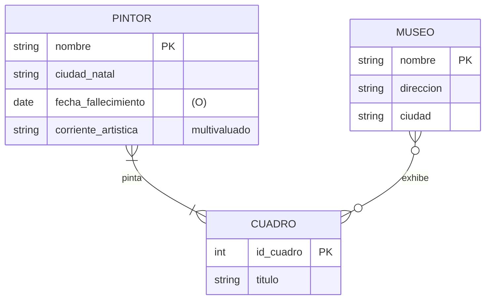
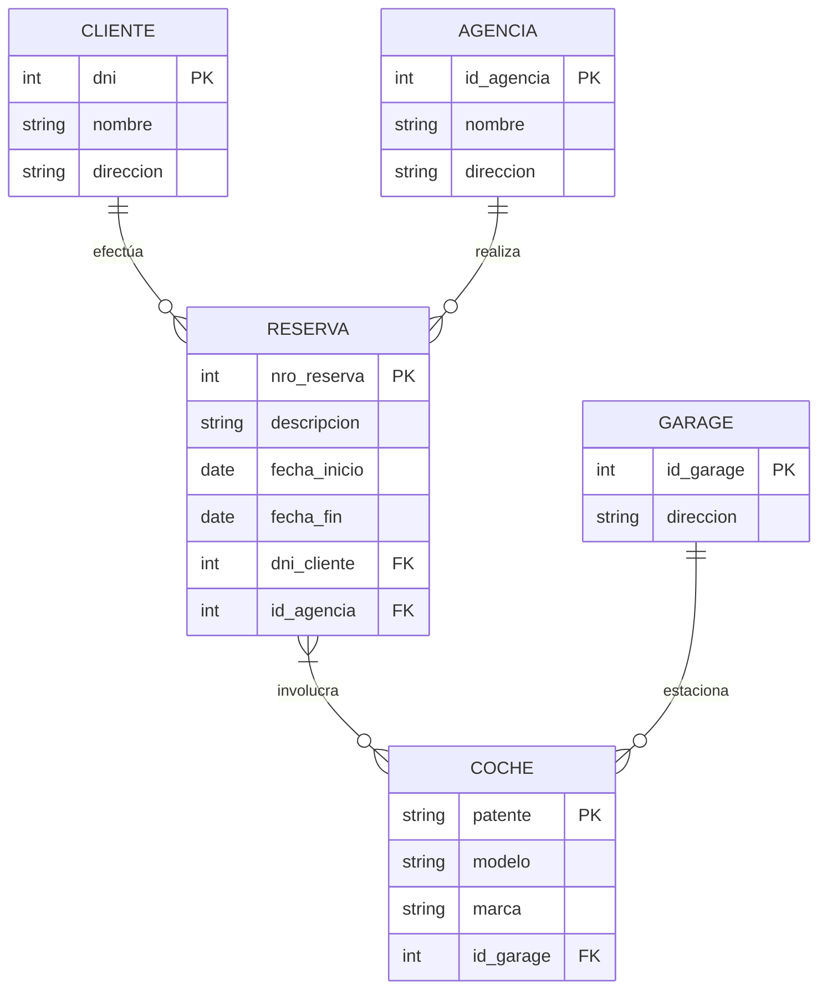
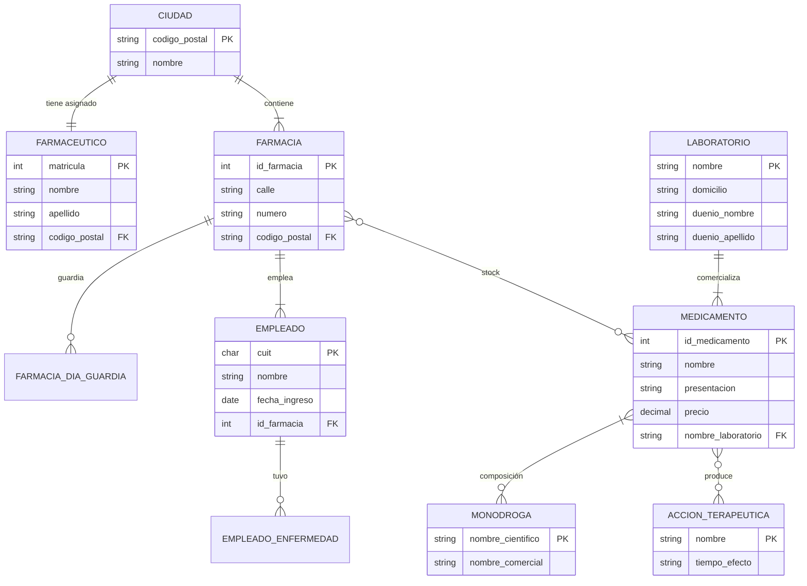

# Unidad I – Trabajo Práctico 2 – Resolución

**Materia:** Bases de Datos · TUCD (UGR) · 2026
**Herramienta de modelado:** ERDPlus (notación Chen modificada de la cátedra)
**SGBD:** MariaDB 11.8.6 · **Script:** [`TP2_esquema.sql`](TP2_esquema.sql) · **Diagrama ER:** [`TP2_DER.drawio`](TP2_DER.drawio) (draw.io, multipágina; mismos estilos que los diagramas de Datos y Algoritmos)

> **Notación**
> - Cardinalidad en pares **(mín, máx)** sobre cada extremo de la relación.
> - Atributo **multivaluado** → doble elipse en ERDPlus (p. ej. `corrienteArtistica`);
>   en el Modelo Relacional se resuelve con una tabla propia.
> - Atributo **opcional** → marca `(O)` en ERDPlus (admite `NULL`).
> - En el Modelo Relacional: `<u>x</u>` = PK, `*x*` = FK.
> - Los casos 1 y 2 respetan el DER de referencia de la cátedra
>   (`../erdplus (4).png` y `../erdplus (5).png`).

---

## Estudio de Caso 1 – Institución de Arte

### Enunciado (resumen)
Modelar **pintores**, **cuadros** y **museos**. Un pintor pinta cuadros y los cuadros se
exponen en varios museos. Nombres de pintor y de museo **no se repiten**. Un cuadro puede
ser pintado por **varios** pintores. Un cuadro puede exponerse **más de una vez en el mismo
museo** en distintos instantes de tiempo.

### DER



**Entidades y atributos**

| Entidad | Atributos |
|---|---|
| `PINTOR` | `nombre` (PK), `ciudad_natal`, `fecha_fallecimiento` `(O)`, `corriente_artistica` **{multivaluado}** |
| `CUADRO` | `id_cuadro` (PK), `titulo` |
| `MUSEO` | `nombre` (PK), `direccion`, `ciudad` |

**Relaciones**

| Relación | Cardinalidades | Tipo | Atributos de la relación |
|---|---|---|---|
| `pinta` | `PINTOR` **(1,N)** — `CUADRO` **(1,N)** | N:M | — |
| `exhibe` | `MUSEO` **(0,N)** — `CUADRO` **(0,N)** | N:M | `inicio_expo`, `final_expo` `(O)` |

- `pinta`: un cuadro tiene al menos un autor y puede tener varios (coautoría); un pintor
  pinta al menos un cuadro. Relación **N:M** → tabla `pinta`.
- `exhibe`: como un mismo cuadro puede exponerse **varias veces en el mismo museo**, el par
  (`museo`, `cuadro`) **no alcanza** como clave: se agrega `inicio_expo` a la clave de la relación.
- `corriente_artistica` es multivaluado (un pintor puede haber pertenecido a una o varias
  corrientes) → tabla `pintor_corriente`.

### Modelo Relacional

```
PINTOR(<u>nombre</u>, ciudad_natal, fecha_fallecimiento)
PINTOR_CORRIENTE(<u>*nombre_pintor*</u>, <u>corriente_artistica</u>)
        *nombre_pintor* → PINTOR.nombre
CUADRO(<u>id_cuadro</u>, titulo)
MUSEO(<u>nombre</u>, direccion, ciudad)
PINTA(<u>*nombre_pintor*</u>, <u>*id_cuadro*</u>)
        *nombre_pintor* → PINTOR.nombre
        *id_cuadro*     → CUADRO.id_cuadro
EXHIBE(<u>*nombre_museo*</u>, <u>*id_cuadro*</u>, <u>inicio_expo</u>, final_expo)
        *nombre_museo* → MUSEO.nombre
        *id_cuadro*    → CUADRO.id_cuadro
```

---

## Estudio de Caso 2 – Sistema de Reservas de Autos

### Enunciado (resumen)
Reservas de una empresa de alquiler de autos. De un **cliente**: DNI, nombre, dirección
(puede haber clientes sin reservas). De una **reserva**: número único, descripción, fecha de
comienzo y fecha final; la realiza **un único** cliente pero involucra **varios** coches. De un
**coche**: modelo, marca, patente (única); tiene siempre asignado un **garage fijo** (no
cambia). De un **garage**: número único y dirección. Cada reserva se realiza en una **agencia**
(número único, nombre, dirección).

### DER



**Relaciones**

| Relación | Cardinalidades | Tipo |
|---|---|---|
| `efectúa` | `CLIENTE` **(0,N)** — `RESERVA` **(1,1)** | 1:N |
| `realiza` | `AGENCIA` **(0,N)** — `RESERVA` **(1,1)** | 1:N |
| `involucra` | `RESERVA` **(1,N)** — `COCHE` **(0,N)** | N:M |
| `estaciona` | `GARAGE` **(0,N)** — `COCHE` **(1,1)** | 1:N |

- `efectúa` y `realiza` son **1:N**: cada reserva pertenece a exactamente un cliente y a
  exactamente una agencia → ambas FK viajan a `RESERVA` como **NOT NULL**. El cliente puede
  tener 0 reservas (`(0,N)`), cumpliendo *"pueden existir clientes que no hayan hecho ninguna reserva"*.
- `estaciona` es **1:N**: cada coche tiene siempre un garage y no puede cambiar → FK
  `id_garage` en `COCHE` **NOT NULL**.
- `involucra` es **N:M**: una reserva involucra varios coches y un coche participa en varias
  reservas a lo largo del tiempo → tabla `reserva_coche`.

### Modelo Relacional

```
CLIENTE(<u>dni</u>, nombre, direccion)
GARAGE(<u>id_garage</u>, direccion)
AGENCIA(<u>id_agencia</u>, nombre, direccion)
COCHE(<u>patente</u>, modelo, marca, *id_garage*)
        *id_garage* → GARAGE.id_garage                    [NOT NULL]
RESERVA(<u>nro_reserva</u>, descripcion, fecha_inicio, fecha_fin, *dni_cliente*, *id_agencia*)
        *dni_cliente* → CLIENTE.dni                       [NOT NULL]
        *id_agencia*  → AGENCIA.id_agencia                [NOT NULL]
RESERVA_COCHE(<u>*nro_reserva*</u>, <u>*patente*</u>)
        *nro_reserva* → RESERVA.nro_reserva
        *patente*     → COCHE.patente
```

---

## Estudio de Caso 3 – Cadena de Farmacias

### Enunciado (resumen)
Cadena de farmacias en varias ciudades. **Ciudad**: nombre y código postal. **Farmacia**: ID,
dirección (calle y número), días de guardia. Una farmacia está en **una sola** ciudad; una
ciudad tiene **más de una** farmacia. Por cada ciudad existe **un único farmacéutico**
afectado a **todas** las farmacias de esa ciudad. En cada farmacia trabajan **varios
empleados** (CUIT, nombre, fecha de ingreso, enfermedades que tuvo); cada empleado trabaja
en **una sola** farmacia. Cada farmacia tiene su **stock** de cada medicamento. **Medicamento**:
nombre, presentación y precio (igual en todas las farmacias); sus **monodrogas** (nombre
científico, nombre comercial, cantidad en el medicamento), el **laboratorio** que lo
comercializa y sus **acciones terapéuticas** (nombre, tiempo en hacer efecto). **Laboratorio**:
nombre único, domicilio, nombre y apellido del dueño; provee varios medicamentos. Una acción
terapéutica **puede repetirse** para distintos medicamentos.

### Decisiones de modelado (información faltante o ambigua)

1. **PK de `CIUDAD`:** se usa `codigo_postal` como PK natural y `nombre` como candidata
   `UNIQUE` (evita duplicar la ciudad por error de tipeo).
2. **`FARMACEUTICO` como entidad propia** con `matricula`, `nombre`, `apellido` (el enunciado
   no da sus atributos). La regla *"un único farmacéutico por ciudad, afectado a todas las
   farmacias de esa ciudad"* es una relación **1:1 entre `FARMACEUTICO` y `CIUDAD`**: se
   implementa con FK `codigo_postal` **UNIQUE + NOT NULL** en `FARMACEUTICO`. El vínculo
   farmacéutico↔farmacia se deduce por la ciudad, no se almacena aparte.
3. **`dias_guardia`** es **multivaluado** (varios días) → tabla `farmacia_dia_guardia`.
4. **`enfermedades`** del empleado es **multivaluado** (solo el nombre) → tabla
   `empleado_enfermedad`.
5. **`MEDICAMENTO`** se identifica naturalmente por (`nombre`, `presentacion`). Para
   simplificar las FK de las tablas que lo referencian se agrega una **PK sustituta**
   `id_medicamento` y se mantiene `UNIQUE(nombre, presentacion)`. Así se soportan las
   consultas de *"medicamentos con el mismo nombre y distinta presentación"*.
6. **`cantidad`** de cada monodroga en el medicamento es un **atributo de la relación** N:M
   `composicion` (con `unidad`, p. ej. `mg`).
7. **`precio`** es atributo de `MEDICAMENTO` (único para toda la cadena), **no** del stock.
8. El **stock** es una relación **N:M** `FARMACIA`–`MEDICAMENTO` con atributo `cantidad`.
9. `tiempo_efecto` se guarda como texto (`'4 horas'`); podría normalizarse a minutos.

### DER



**Relaciones**

| Relación | Cardinalidades | Tipo | Atributos |
|---|---|---|---|
| ciudad–farmacéutico | `CIUDAD` **(1,1)** — `FARMACEUTICO` **(1,1)** | 1:1 | — |
| ciudad–farmacia | `CIUDAD` **(1,N)** — `FARMACIA` **(1,1)** | 1:N | — |
| farmacia–empleado | `FARMACIA` **(1,N)** — `EMPLEADO` **(1,1)** | 1:N | — |
| laboratorio–medicamento | `LABORATORIO` **(1,N)** — `MEDICAMENTO` **(1,1)** | 1:N | — |
| `composicion` | `MEDICAMENTO` **(1,N)** — `MONODROGA` **(0,N)** | N:M | `cantidad`, `unidad` |
| `medicamento_accion` | `MEDICAMENTO` **(0,N)** — `ACCION_TERAPEUTICA` **(0,N)** | N:M | — |
| `stock` | `FARMACIA` **(0,N)** — `MEDICAMENTO` **(0,N)** | N:M | `cantidad` |
| `dias_guardia` (multivaluado) | `FARMACIA` **(1,1)** — `FARMACIA_DIA_GUARDIA` **(0,N)** | 1:N | `dia` |
| `enfermedades` (multivaluado) | `EMPLEADO` **(1,1)** — `EMPLEADO_ENFERMEDAD` **(0,N)** | 1:N | `nombre_enfermedad` |

### Modelo Relacional

```
CIUDAD(<u>codigo_postal</u>, nombre)
FARMACEUTICO(<u>matricula</u>, nombre, apellido, *codigo_postal*)
        *codigo_postal* → CIUDAD.codigo_postal            [UNIQUE, NOT NULL]  (1:1)
FARMACIA(<u>id_farmacia</u>, calle, numero, *codigo_postal*)
        *codigo_postal* → CIUDAD.codigo_postal            [NOT NULL]
FARMACIA_DIA_GUARDIA(<u>*id_farmacia*</u>, <u>dia</u>)
        *id_farmacia* → FARMACIA.id_farmacia
EMPLEADO(<u>cuit</u>, nombre, fecha_ingreso, *id_farmacia*)
        *id_farmacia* → FARMACIA.id_farmacia              [NOT NULL]
EMPLEADO_ENFERMEDAD(<u>*cuit_empleado*</u>, <u>nombre_enfermedad</u>)
        *cuit_empleado* → EMPLEADO.cuit
LABORATORIO(<u>nombre</u>, domicilio, duenio_nombre, duenio_apellido)
MEDICAMENTO(<u>id_medicamento</u>, nombre, presentacion, precio, *nombre_laboratorio*)
        UNIQUE(nombre, presentacion)
        *nombre_laboratorio* → LABORATORIO.nombre         [NOT NULL]
MONODROGA(<u>nombre_cientifico</u>, nombre_comercial)
COMPOSICION(<u>*id_medicamento*</u>, <u>*nombre_cientifico*</u>, cantidad, unidad)
        *id_medicamento*   → MEDICAMENTO.id_medicamento
        *nombre_cientifico* → MONODROGA.nombre_cientifico
ACCION_TERAPEUTICA(<u>nombre</u>, tiempo_efecto)
MEDICAMENTO_ACCION(<u>*id_medicamento*</u>, <u>*nombre_accion*</u>)
        *id_medicamento* → MEDICAMENTO.id_medicamento
        *nombre_accion*  → ACCION_TERAPEUTICA.nombre
STOCK(<u>*id_farmacia*</u>, <u>*id_medicamento*</u>, cantidad)
        *id_farmacia*    → FARMACIA.id_farmacia
        *id_medicamento* → MEDICAMENTO.id_medicamento
```

### Consultas que el modelo habilita
- Alternativas para un medicamento compuesto por **una** monodroga →
  `SELECT ... FROM composicion GROUP BY id_medicamento HAVING COUNT(*) = 1`.
- Medicamentos de un laboratorio → filtro por `medicamento.nombre_laboratorio`.
- Medicamentos con el mismo nombre y distinta presentación →
  `SELECT nombre FROM medicamento GROUP BY nombre HAVING COUNT(*) > 1`.
- El script incluye los datos de ejemplo de **Dorixina Forte** para probar estas consultas.

---

## Bases de datos generadas por `TP2_esquema.sql`

| Base | Caso | Tablas |
|---|---|---|
| `u1_tp2_arte` | 1 | `pintor`, `pintor_corriente`, `cuadro`, `museo`, `pinta`, `exhibe` |
| `u1_tp2_reservas` | 2 | `cliente`, `garage`, `agencia`, `coche`, `reserva`, `reserva_coche` |
| `u1_tp2_farmacias` | 3 | `ciudad`, `farmaceutico`, `farmacia`, `farmacia_dia_guardia`, `empleado`, `empleado_enfermedad`, `laboratorio`, `medicamento`, `monodroga`, `composicion`, `accion_terapeutica`, `medicamento_accion`, `stock` |
