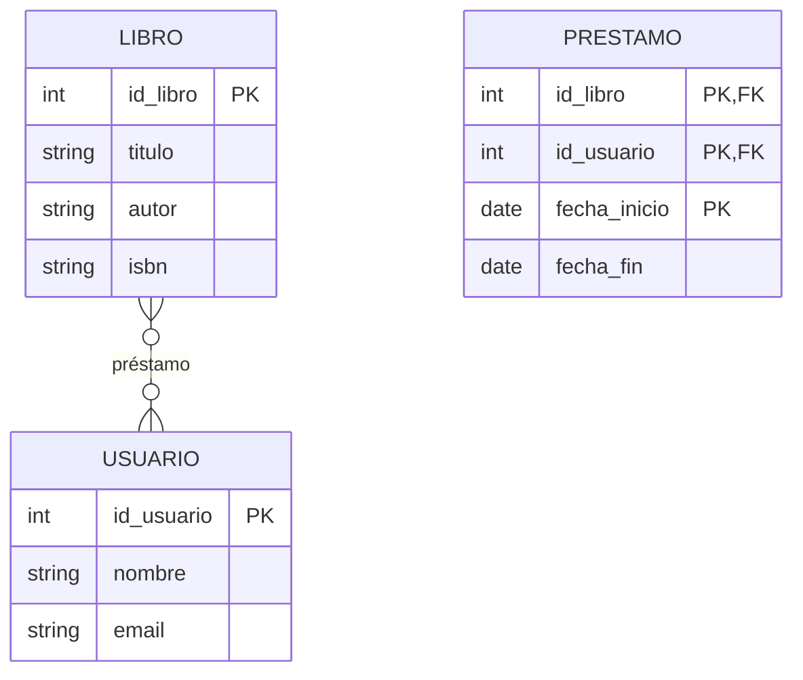
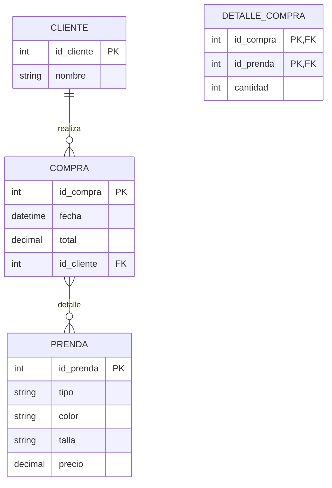
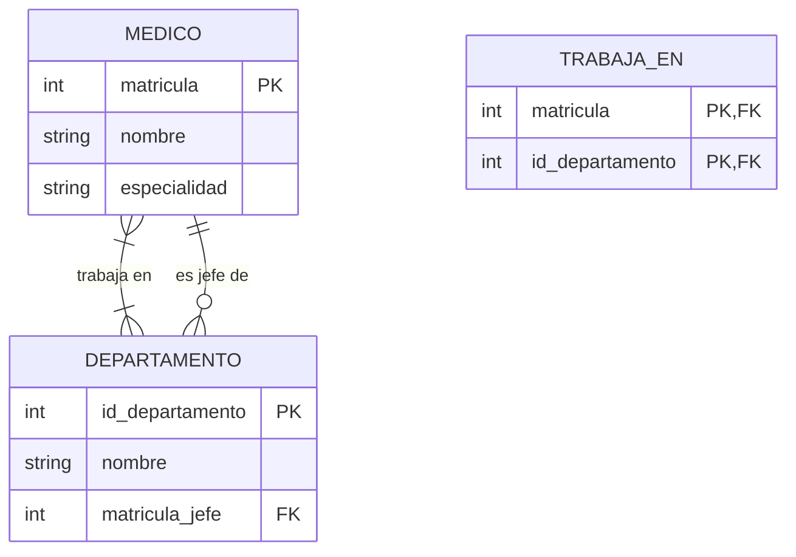
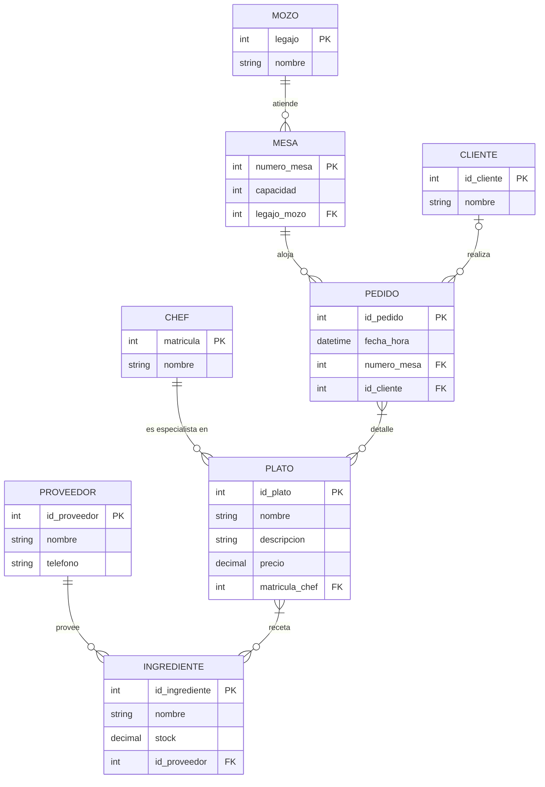

# Unidad I – Trabajo Práctico 3 – Resolución

**Materia:** Bases de Datos · TUCD (UGR) · 2026
**Herramienta de modelado:** ERDPlus (notación Chen modificada de la cátedra)
**SGBD:** MariaDB 11.8.6 · **Script:** [`TP3_esquema.sql`](TP3_esquema.sql) · **Diagrama ER:** [`TP3_DER.drawio`](TP3_DER.drawio) (draw.io, multipágina; mismos estilos que los diagramas de Datos y Algoritmos)

> **Notación:** cardinalidad en pares **(mín, máx)**; en el Modelo Relacional
> `<u>x</u>` = PK y `*x*` = FK. Las relaciones N:M se resuelven con tabla intermedia.

---

## Ejercicio 1 – De explicación coloquial a DER y Modelo Relacional

### a) Biblioteca

> Los libros son prestados a los usuarios. Un libro puede prestarse a uno o más usuarios y
> un usuario puede tener uno o más libros. Cada préstamo tiene fecha de inicio y fecha de fin.



| Elemento | Detalle |
|---|---|
| `LIBRO` | `id_libro` (PK), `titulo`, `autor`, `isbn` |
| `USUARIO` | `id_usuario` (PK), `nombre`, `email` |
| Relación `presta` | `LIBRO` **(0,N)** — `USUARIO` **(0,N)** → **N:M**, atributos `fecha_inicio`, `fecha_fin` |

Un mismo libro se presta muchas veces a lo largo del tiempo, por lo que el par
(`libro`, `usuario`) no identifica el préstamo: se suma `fecha_inicio` a la clave.

**Modelo Relacional**

```
LIBRO(<u>id_libro</u>, titulo, autor, isbn)
USUARIO(<u>id_usuario</u>, nombre, email)
PRESTAMO(<u>*id_libro*</u>, <u>*id_usuario*</u>, <u>fecha_inicio</u>, fecha_fin)
        *id_libro*   → LIBRO.id_libro
        *id_usuario* → USUARIO.id_usuario
```

---

### b) Tienda de ropa

> Cada prenda tiene color, talla y precio. Los clientes compran una o más prendas en una
> misma compra. Cada compra tiene fecha y total.



| Elemento | Detalle |
|---|---|
| `CLIENTE` | `id_cliente` (PK), `nombre` |
| `PRENDA` | `id_prenda` (PK), `tipo`, `color`, `talla`, `precio` |
| `COMPRA` | `id_compra` (PK), `fecha`, `total` |
| `realiza` | `CLIENTE` **(0,N)** — `COMPRA` **(1,1)** → **1:N** |
| `detalle` | `COMPRA` **(1,N)** — `PRENDA` **(0,N)** → **N:M**, atributo `cantidad` |

**Modelo Relacional**

```
CLIENTE(<u>id_cliente</u>, nombre)
PRENDA(<u>id_prenda</u>, tipo, color, talla, precio)
COMPRA(<u>id_compra</u>, fecha, total, *id_cliente*)
        *id_cliente* → CLIENTE.id_cliente                 [NOT NULL]
DETALLE_COMPRA(<u>*id_compra*</u>, <u>*id_prenda*</u>, cantidad)
        *id_compra* → COMPRA.id_compra
        *id_prenda* → PRENDA.id_prenda
```

---

### c) Hospital

> Cada departamento tiene un nombre y un jefe. Los médicos trabajan en uno o más
> departamentos y un departamento puede tener uno o más médicos.



| Elemento | Detalle |
|---|---|
| `MEDICO` | `matricula` (PK), `nombre`, `especialidad` |
| `DEPARTAMENTO` | `id_departamento` (PK), `nombre` |
| `es jefe de` | `MEDICO` **(0,N)** — `DEPARTAMENTO` **(0,1)** → **1:N** |
| `trabaja en` | `MEDICO` **(1,N)** — `DEPARTAMENTO` **(1,N)** → **N:M** |

**Decisión:** *"jefe"* se modela como un rol: el jefe de un departamento **es un médico**, por
lo que se resuelve con una FK `matricula_jefe` (opcional) en `DEPARTAMENTO`, en vez de un
atributo de texto suelto. Así el jefe queda íntegro (referencia a un médico real).

**Modelo Relacional**

```
MEDICO(<u>matricula</u>, nombre, especialidad)
DEPARTAMENTO(<u>id_departamento</u>, nombre, *matricula_jefe*)
        *matricula_jefe* → MEDICO.matricula               [NULL permitido]
TRABAJA_EN(<u>*matricula*</u>, <u>*id_departamento*</u>)
        *matricula*       → MEDICO.matricula
        *id_departamento* → DEPARTAMENTO.id_departamento
```

---

### d) Restaurante

> Cada plato tiene nombre, descripción y precio, y cuenta con ingredientes. Cada ingrediente
> tiene stock y un proveedor. Los clientes piden uno o más platos en una mesa (número,
> capacidad). Cada mesa la atiende un mozo; cada plato es especialidad de un chef.



**Relaciones**

| Relación | Cardinalidades | Tipo | Atributos |
|---|---|---|---|
| `provee` | `PROVEEDOR` **(0,N)** — `INGREDIENTE` **(1,1)** | 1:N | — |
| `es especialidad de` | `CHEF` **(0,N)** — `PLATO` **(1,1)** | 1:N | — |
| `receta` | `PLATO` **(1,N)** — `INGREDIENTE` **(0,N)** | N:M | `cantidad` |
| `atiende` | `MOZO` **(0,N)** — `MESA` **(1,1)** | 1:N | — |
| `aloja` | `MESA` **(0,N)** — `PEDIDO` **(1,1)** | 1:N | — |
| `realiza` | `CLIENTE` **(0,N)** — `PEDIDO` **(0,1)** | 1:N | — |
| `detalle` | `PEDIDO` **(1,N)** — `PLATO` **(0,N)** | N:M | `cantidad` |

**Decisiones:**
- Se introduce la entidad `PEDIDO` (con `fecha_hora`) para representar *"los clientes piden
  uno o más platos en una mesa"*: cada pedido pertenece a una mesa y agrupa varios platos
  (`detalle_pedido` con `cantidad`).
- `CLIENTE` es opcional en el pedido (`id_cliente` admite `NULL`): el enunciado no obliga a
  identificar al comensal.
- `stock` del ingrediente se guarda como atributo simple de `INGREDIENTE` (no hay depósitos
  múltiples en el enunciado).

**Modelo Relacional**

```
PROVEEDOR(<u>id_proveedor</u>, nombre, telefono)
CHEF(<u>matricula</u>, nombre)
MOZO(<u>legajo</u>, nombre)
CLIENTE(<u>id_cliente</u>, nombre)
INGREDIENTE(<u>id_ingrediente</u>, nombre, stock, *id_proveedor*)
        *id_proveedor* → PROVEEDOR.id_proveedor           [NOT NULL]
PLATO(<u>id_plato</u>, nombre, descripcion, precio, *matricula_chef*)
        *matricula_chef* → CHEF.matricula                 [NOT NULL]
RECETA(<u>*id_plato*</u>, <u>*id_ingrediente*</u>, cantidad)
        *id_plato*       → PLATO.id_plato
        *id_ingrediente* → INGREDIENTE.id_ingrediente
MESA(<u>numero_mesa</u>, capacidad, *legajo_mozo*)
        *legajo_mozo* → MOZO.legajo                       [NOT NULL]
PEDIDO(<u>id_pedido</u>, fecha_hora, *numero_mesa*, *id_cliente*)
        *numero_mesa* → MESA.numero_mesa                  [NOT NULL]
        *id_cliente*  → CLIENTE.id_cliente                [NULL permitido]
DETALLE_PEDIDO(<u>*id_pedido*</u>, <u>*id_plato*</u>, cantidad)
        *id_pedido* → PEDIDO.id_pedido
        *id_plato*  → PLATO.id_plato
```

---

## Ejercicio 2 – De Diagrama Entidad-Relación a Modelo Relacional

> **Falta material.** Los DER de los incisos **a, b, c, d y e** son imágenes que **no están
> incluidas** en la carpeta `Unidad 1/`. Solo está el texto de la consigna.
> Para resolverlo necesito que compartas las cinco imágenes.
>
> **Método a aplicar cuando estén disponibles** (para cada DER):
> 1. **Completar/corregir el DER:** verificar que toda entidad tenga PK, que las
>    relaciones tengan cardinalidad `(mín, máx)` en ambos extremos y que los atributos
>    estén en la entidad correcta (mover multivaluados a entidad propia, etc.).
> 2. **Mapear a tablas:** una tabla por entidad; relaciones 1:N → FK en el lado "N";
>    relaciones N:M → tabla intermedia con las dos FK como PK compuesta; entidades
>    débiles → PK = FK del fuerte + clave parcial.
> 3. **Escribir el Modelo Relacional** con `<u>PK</u>` y `*FK*`, indicando a qué columna
>    apunta cada FK y si admite `NULL`.

---

## Bases de datos generadas por `TP3_esquema.sql`

| Base | Inciso | Tablas |
|---|---|---|
| `u1_tp3_biblioteca` | a | `libro`, `usuario`, `prestamo` |
| `u1_tp3_tienda_ropa` | b | `cliente`, `prenda`, `compra`, `detalle_compra` |
| `u1_tp3_hospital` | c | `medico`, `departamento`, `trabaja_en` |
| `u1_tp3_restaurante` | d | `proveedor`, `chef`, `mozo`, `cliente`, `ingrediente`, `plato`, `receta`, `mesa`, `pedido`, `detalle_pedido` |
