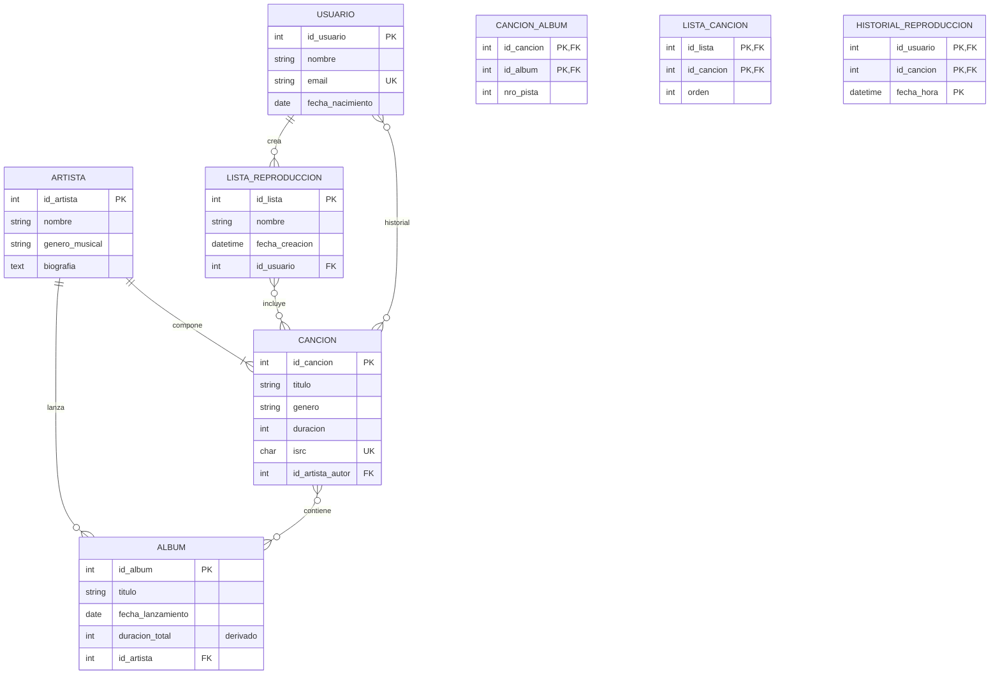

# Unidad I – Trabajo Práctico 4 – Resolución

**Materia:** Bases de Datos · TUCD (UGR) · 2026
**Estudio de caso:** Aplicación de música en línea
**Herramienta de modelado:** ERDPlus (notación Chen modificada de la cátedra)
**SGBD:** MariaDB 11.8.6 · **Script:** [`TP4_esquema.sql`](TP4_esquema.sql)

> **Notación:** cardinalidad en pares **(mín, máx)**; en el Modelo Relacional
> `<u>x</u>` = PK y `*x*` = FK.

---

## 1. Análisis del enunciado

La aplicación gestiona **usuarios** que escuchan y organizan **canciones** de una biblioteca
en línea. Las canciones son creadas por **artistas** y pueden estar contenidas en **álbumes**.
Los usuarios arman **listas de reproducción** privadas y dejan un **historial** de escucha.

### Reglas de negocio relevantes

| Regla | Consecuencia en el modelo |
|---|---|
| Un usuario tiene datos personales + historial de escuchas | Entidad `USUARIO` + relación N:M `historial` con `fecha_hora` |
| Una canción tiene título, género, duración, ISRC y **un único autor** | `CANCION` con FK `id_artista_autor` **NOT NULL** (1:1 hacia artista por el lado canción) |
| Una canción puede ser **single (sin álbum)** o pertenecer a **uno o varios** álbumes | Relación **N:M** `CANCION`–`ALBUM` (`cancion_album`) |
| Un álbum tiene título, artista que lo lanzó, fecha, duración total e ID propio | `ALBUM` con FK `id_artista` **NOT NULL** |
| Un álbum **no puede estar vacío** (≥ 1 canción) | Participación **(1,N)** de `ALBUM` en `cancion_album` (se controla por aplicación/trigger) |
| Un álbum puede incluir canciones de **varios artistas** | El autor está en `CANCION`, no en `ALBUM`; el N:M lo permite |
| Un artista tiene nombre, género musical y biografía; debe tener **≥ 1 canción**; puede no tener álbumes | `ARTISTA`; participación **(1,N)** con `CANCION` (control por aplicación) |
| Un usuario crea **múltiples** listas, puede tener listas vacías o ninguna | Relación **1:N** `USUARIO`–`LISTA_REPRODUCCION` |
| **No** puede haber dos listas con el mismo nombre en un usuario | `UNIQUE(id_usuario, nombre)` en `LISTA_REPRODUCCION` |
| Las listas **no se comparten** entre usuarios | La lista pertenece a un único usuario (FK **NOT NULL**) |
| Una lista contiene **cualquier combinación** de canciones; se ordena por nombre o fecha | Relación **N:M** `lista_cancion`; `LISTA_REPRODUCCION` tiene `nombre` y `fecha_creacion` |

---

## 2. Consideraciones realizadas (información faltante o ambigua)

1. **Identificadores sustitutos** `id_usuario`, `id_artista`, `id_album`, `id_cancion`,
   `id_lista` (autonuméricos), porque el enunciado pide *"algún identificador único"* y
   varios atributos naturales no son buenos candidatos.
2. **`email` de usuario** se define `UNIQUE` (identificador alternativo natural).
3. **`ISRC`** se define `UNIQUE` (es un código estándar internacional por grabación).
4. **`duracion`** (canción) y **`duracion_total`** (álbum) se expresan en **segundos**
   (`INT`). `duracion_total` es un **atributo derivado** (suma de las canciones del álbum):
   se deja la columna para consulta rápida, pero podría calcularse con una vista.
5. **`genero`** se modela como atributo de `CANCION` (texto). Si se quisiera un catálogo
   cerrado, se crearía una entidad `GENERO` con relación 1:N.
6. El **autor** de una canción es obligatorio y único → FK `id_artista_autor` **NOT NULL**.
   El *"artista que lanzó"* un álbum también es obligatorio → FK `id_artista` **NOT NULL**
   en `ALBUM` (es el titular del álbum, distinto de los autores de cada canción).
7. **`historial`** se modela como relación **N:M** `USUARIO`–`CANCION` con `fecha_hora` en
   la clave (una misma canción puede escucharse muchas veces).
8. **`orden`** en `lista_cancion` y **`nro_pista`** en `cancion_album` son atributos de esas
   relaciones para permitir ordenar; `nro_pista` es `UNIQUE` dentro de cada álbum.
9. Las restricciones *"álbum no vacío"* y *"artista con ≥ 1 canción"* son de
   **participación mínima (1,N)**: no se pueden imponer con `NOT NULL`/FK solamente
   (requerirían disparadores); quedan documentadas y bajo control de la capa de aplicación.
10. Las listas **no compartidas** ⇒ no existe relación entre `LISTA_REPRODUCCION` y varios
    usuarios; el vínculo es estrictamente 1:N.

---

## 3. DER



**Relaciones**

| Relación | Cardinalidades | Tipo | Atributos |
|---|---|---|---|
| `lanza` | `ARTISTA` **(0,N)** — `ALBUM` **(1,1)** | 1:N | — |
| `compone` | `ARTISTA` **(1,N)** — `CANCION` **(1,1)** | 1:N | — |
| `contiene` | `CANCION` **(0,N)** — `ALBUM` **(1,N)** | N:M | `nro_pista` |
| `crea` | `USUARIO` **(0,N)** — `LISTA_REPRODUCCION` **(1,1)** | 1:N | — |
| `incluye` | `LISTA_REPRODUCCION` **(0,N)** — `CANCION` **(0,N)** | N:M | `orden` |
| `historial` | `USUARIO` **(0,N)** — `CANCION` **(0,N)** | N:M | `fecha_hora` |

---

## 4. Modelo Relacional

```
USUARIO(<u>id_usuario</u>, nombre, email, fecha_nacimiento)
        UNIQUE(email)
ARTISTA(<u>id_artista</u>, nombre, genero_musical, biografia)
ALBUM(<u>id_album</u>, titulo, fecha_lanzamiento, duracion_total, *id_artista*)
        *id_artista* → ARTISTA.id_artista                 [NOT NULL]  (artista que lo lanzó)
CANCION(<u>id_cancion</u>, titulo, genero, duracion, isrc, *id_artista_autor*)
        UNIQUE(isrc)
        *id_artista_autor* → ARTISTA.id_artista           [NOT NULL]  (autor único)
CANCION_ALBUM(<u>*id_cancion*</u>, <u>*id_album*</u>, nro_pista)
        UNIQUE(id_album, nro_pista)
        *id_cancion* → CANCION.id_cancion
        *id_album*   → ALBUM.id_album
LISTA_REPRODUCCION(<u>id_lista</u>, nombre, fecha_creacion, *id_usuario*)
        UNIQUE(id_usuario, nombre)
        *id_usuario* → USUARIO.id_usuario                 [NOT NULL]
LISTA_CANCION(<u>*id_lista*</u>, <u>*id_cancion*</u>, orden)
        *id_lista*   → LISTA_REPRODUCCION.id_lista
        *id_cancion* → CANCION.id_cancion
HISTORIAL_REPRODUCCION(<u>*id_usuario*</u>, <u>*id_cancion*</u>, <u>fecha_hora</u>)
        *id_usuario* → USUARIO.id_usuario
        *id_cancion* → CANCION.id_cancion
```

---

## 5. Base de datos generada

| Base | Tablas |
|---|---|
| `u1_tp4_musica` | `usuario`, `artista`, `album`, `cancion`, `cancion_album`, `lista_reproduccion`, `lista_cancion`, `historial_reproduccion` |
